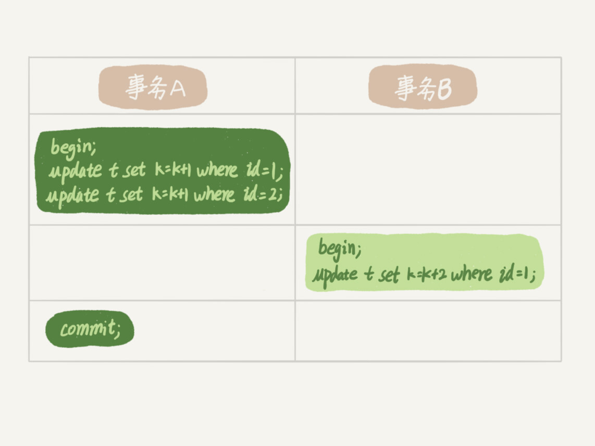
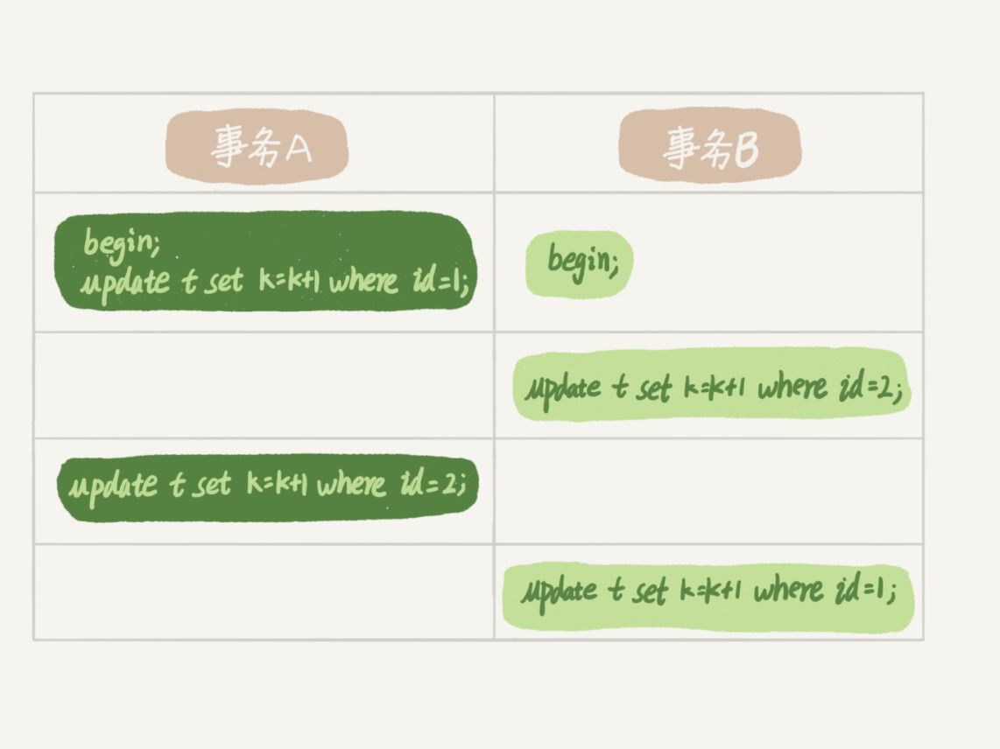

# MySQL实战45讲

## 基础篇

### 一、基础架构

mysql可以分为Server层和存储引擎层两部分。

* Server层：包括连接器、查询缓存、分析器、优化器、执行器等；涵盖mysql的大多数核心服务功能，以及所有的内置函数；所有跨存储引擎的功能，比如存储过程、触发器、视图等。
* 存储层：负责数据的存储和提取。其架构是插件式的，支持InnoDB、MyISAM、Memory等多个存储引擎。从mysql5.5.5开始，InnoDB为默认的存储引擎。

#### 连接器

作用：连接器负责跟客户端建立连接、获取权限、维持和管理连接。

注意：

* **用户的权限修改**后不会影响该用户已建立的连接的权限，新建的连接才会使用更新后的权限。
* 连接完成后，如果没有后续动作，该连接就处于空闲状态，使用`show processlist`查看。如果**客户端太长时间没动静，连接器就会自动将该连接断开**。这个时间由`wait_timeout`控制，默认8个小时。
* 连接被断开后，客户端再次发送请求后，就会收到一个错误提醒：Lost connection to MySQL server during query。如果要继续，就需要重连。
* 建立连接的过程通常比较复杂，尽量使用长连接。
* 由于mysql执行时**临时使用的内存是管理在连接对象**里，这些资源会在连接断开的时候才释放。如果**长连接积累下来，可能导致内存占用太大**，而被系统强行杀掉(OOM)，从现象看就是mysql异常重启。解决方案：
  1. 定期断开长连接。使用一段时间，或者程序里判断执行过一个占用内存的大查询后，主动断开连接，之后要查询再重连；
  2. 版本大于5.7，可以在每次执行一个比较大的操作后，通过执行`mysql_reset_connection`来重新初始化连接资源。这个过程不会重连和重新做权限验证，但会将连接恢复到刚刚创建完时的状态。

#### 查询缓存

​		连接建立后，如果执行的是select语句，就会先去查询缓存。执行过的语句及其结果会以k-v形式缓存在内存中，key是查询的语句，value是查询的结果。

作用：命中缓存后，会直接返回结果给客户端，无需执行后续流程。

注意：

* 当更新一张表时，此时这张表上的所有查询缓存都会被清空。因此对于更新频繁的表，其查询缓存命中率很低。如果是系统配置表等静态表，比较适合使用查询缓存。可以“按需使用”：

  ~~~sql
  # 在mysql的配置文件中配置按需形式，对于默认的SQL语句都不使用查询缓存
  query_cache_type = DEMAND
  
  # 确定要使用查询缓存的语句，通过SQL_CACHE显示指定
  select SQL_CACHE * from table
  ~~~

* MySQL8.0版本直接将查询缓存功能删掉。

#### 分析器

​		如果没有命中查询缓存，就开始真正执行语句。首先要对SQL语句进行解析。

​		分析器先做“词法分析”，识别出语句中的字符串分别代表什么；然后做“语法分析”，语法分析器根据语法规则，判断语句是否满足MySQL语法。

#### 优化器

​		MySQL知道要做什么了后，在开始执行前，需要经过优化器处理。

作用：根据执行效率，选择较优的方案，比如使用哪个索引、多表关联时，决定各个表的连接顺序。

#### 执行器

​		MySQL通过分析器知道要做什么，通过优化器知道该怎么做后，开始进入执行阶段。

​		执行前，首先校验执行权限（查询缓存返回结果时，也会校验权限；查询在优化器之前调用precheck验证权限）。

​		如果有权限，则打开表，根据表的引擎定义，使用这个引擎提供的接口，按要求遍历表，满足要求则将行放入结果集中，直到表的最后一行。最后将满足条件的行组成的记录集作为结果集返回给客户端。

**至此，一条语句就执行完成了。**

tip：

* 慢查询日志中有个`rows_examined`字段，表示语句执行过程中扫描了多少行，这个值是在执行器每次调用引擎获取数据行的时候累加的。但是，在某些情况下，执行器调用一次，在引擎内部可能会扫描多行，因此**引擎扫描行数跟`rows_examined`字段并非完全相同**。

思考题：

​		如果表 T 中没有字段 k，而你执行了这个语句 select * from T where k=1, 那肯定是会报“不存在这个列”的错误： “Unknown column ‘k’ in ‘where clause’”。这个错误是在哪个阶段报出来的呢？

​		答：在分析器处理阶段，**解析器**处理语法和解析查询，生成一颗对应的解析树；**预处理器**进一步检查解析树的合法性，会检查数据表和数据列是否存在、别名是否有歧义等。如果通过，则生成新的解析树，再提交给优化器。

### 二、日志系统

​		更新流程涉及到redo log(重做日志)和binlog(归档日志)。

​		redo log是InnoDB引擎特有的日志，binlog是Server层的日志。

#### binlog

binlog用于归档，只依靠binlog是没有crash-safe能力。

#### redo log

​		如果每一次更新操作都需要在磁盘中找到对应的记录，并更新，这整个过程的IO成本、查找成本都很高。因此MySQL使用了WAL(Write-Ahead Logging)，即先写日志，再写磁盘。

​		具体来说，当需要更新一条记录时，InnoDB引擎会先将记录写到redo log中，并更新内存，**这时更新就算完成**。在合适的时机，会将这条更新记录写入磁盘。

redo log数据结构：

​		作用：有了redo log，InnoDB就可以保证即使数据库发生异常重启，之前提交的记录都不会丢失，这个能力称为**crash-safe**.

binlog和redo log的不同：

1. redo log 是 InnoDB 引擎特有的；binlog 是 MySQL 的 Server 层实现的，所有引擎都可以使用。
2. redo log 是**物理**日志，记录的是更底层的操作指令，比如“在某个数据页上做了什么修改”；binlog 是**逻辑**日志，记录的是这个语句的原始逻辑，比如“给 ID=2 这一行的 c 字段加 1 ”。
3. redo log 是**循环写**的，空间固定会用完；binlog 是可以**追加写**入的，并不会覆盖以前的日志。

tip:

* 通过**两阶段提交**方式完成对redo log和binlog的写入，下图的最后三步。深色在执行器中，浅色在引擎中执行。

  两阶段提交是**跨系统维持数据逻辑一致性**时常用的一个方案。

  ​		如果不使用两阶段提交方式写入日志：

  * 如果先写redo log，redo log写完，binlog正在写入时，系统宕机，虽然redo log记录了完备的数据，可以进行恢复，但binlog缺失数据，用binlog则会丢失数据；
  
  * 如果先写binlog，binlog写完，redo log正在写入时，系统宕机，恢复后，这个事务无效，binlog记录的崩溃时事务未完成的日志是多余的，根据binlog恢复的数据就出现不一致。

* `innodb_flush_log_at_trx_commit=1`表示每次事务的redo log都直接持久化到磁盘，可以保证mysql异常重启后数据不丢失；
* `sync_binlog=1`表示每次事务的binlog都持久化到磁盘，可以保证mysql异常重启后binlog不丢失；

思考题：定期全量备份，一天一备和一周一备有什么区别？

答：恢复时间，一天一备比一周一备所恢复的时间短；binlog完整性，由于根据binlog恢复需要保证binlog的数据时完整的，那么一天一备与一周一备相比，更容易保证binlog数据的完整性，binlog的完整性可以通过校验、冗余等技术来实现；存储空间，更频繁的全量备份会消耗更多的存储

### 三、事务隔离

​		当数据库上有多个事务同时执行的时候，就可能出现脏读（dirty read）、不可重复读（non-repeatable read）、幻读（phantom read）的问题，为了解决这些问题，就有了“隔离级别”的概念。

1. **脏读（Dirty Read）**

**定义**：一个事务读取了另一个事务尚未提交的数据。如果那个事务回滚了，那么前一个事务读取的就是“脏数据”。

#### 示例：

- 事务A：更新账户余额为 **1000 → 500**，但**尚未提交**。
- 同时，事务B：读取账户余额，发现是 **500**。
- 此时，事务A发生故障，**回滚**，账户余额恢复为 **1000**。
- 但事务B已经读取并可能使用了错误的 **500**，这就是脏读。

**对策**：**设置隔离级别为 READ COMMITTED 或更高**可以防止脏读。

2. **不可重复读（Non-repeatable Read）**

**定义**：在一个事务内，多次读取同一数据时，发现读取结果**不一致**，因为中间其他事务对该数据做了**更新**或**删除**并提交。

#### 示例：

- 事务A：第一次读取用户余额，发现是 **1000**。
- 此时，事务B：将余额更新为 **800**，并提交。
- 事务A再次读取余额，发现变成了 **800**。
- 同一个事务中读取结果不一致，这就是不可重复读。

**对策**：**设置隔离级别为 REPEATABLE READ 或更高**可以防止不可重复读。

3. **幻读（Phantom Read）**

**定义**：一个事务多次查询某些**符合条件的记录集合**，每次结果的数量不一致，原因是其他事务对表中插入或删除了符合条件的新记录。

#### 示例：

- 事务A：查询年龄大于 18 岁的用户，查到 10 条记录。
- 同时，事务B：插入一个年龄为 20 岁的新用户，并提交。
- 事务A再次执行同样的查询，发现结果变为 11 条。
- 多出了一条“幻影”记录，这就是幻读。

**对策**：

- 普通 REPEATABLE READ 只能防止不可重复读，但**无法防止幻读**。
- **SERIALIZABLE 隔离级别**才能彻底防止幻读（通过加锁等方式）。

SQL标准的**隔离级别**有四个：

1. 读未提交：一个事务还没提交时，它做的变更会被其他事务看到。

   下图所示，在该隔离级别下，v1=v2=v3=2

2. 读提交：一个事务提交后，它做的变更才会被其他事务看到。

   下图所示，在该隔离级别下，v1=1, v2=v3=2

3. 可重复读：一个事务执行过程中读取到的数据，**总是跟这个事务启动时读取到的数据是一致的**。但是**更新也只是更新本事务读取到的数据**，而不会更新到其他事务已经更新过的数据。即同时有多个事务更新，可能会覆盖其他事务的更新。

   下图所示，在该隔离级别下，v1=v2=1, v3=2

4. 串行化：对于同一行记录，写会加写锁，读会加读锁。当出现读写锁冲突时，后访问的事务必须等待前一个事务执行完才能继续执行。

   下图所示，在该隔离级别下，v1=v2=1, v3=2

#### 事务隔离的具体实现

​		在实现上，数据库里面会创建一个**一致性读视图**，访问的时候以视图的逻辑结果为准。

* 在“读未提交”隔离级别下直接返回记录上的最新值，**没有视图**概念。
* 在“读提交”隔离级别下，这个视图是在**每个 SQL 语句开始执行的时候创建**的。
* 在“可重复读”隔离级别
  * 使用`begin/start transcation`开启事务时，一致性视图在执行**第一个快照读语句时创建**
  * 使用`start transcation with consistent snapshot`**开启事务时，一致性视图就创建完成**

* 在“串行化”隔离级别下直接用**加锁**的方式来避免并行访问。 

事务启动的时机：

| 事务A(k=1)                                 | 事务B(k=1)                                 | 事务C(k=1)                       |
| ------------------------------------------ | ------------------------------------------ | -------------------------------- |
| start translation with consistent snapshot |                                            |                                  |
|                                            | start translation with consistent snapshot |                                  |
|                                            |                                            | update t set k=k+1 where id = 1; |
|                                            | update t set k=k+1 where id = 1;           |                                  |
|                                            | select k from t where id = 1;              |                                  |
| select k from t where id = 1;              |                                            |                                  |
| commit;                                    |                                            |                                  |
|                                            | Commit;                                    |                                  |

​		`begin/start transaction` 命令并不是一个事务的起点，在执行到它们之后的第一个操作 InnoDB 表的语句，事务才真正启动。如果你想要**马上启动**一个事务，可以使用`start transaction with consistent snapshot` 这个命令。

* 第一种启动方式：一致性视图是在执行第一个**快照读语句**时创建的；
* 第二种启动方式，一致性视图是在执行 start transaction with consistent snapshot 时创建的。

​        默认autocommit=1。在上表中，事务C没有显式地使用 begin/commit，表示这个 update 语句本身就是一个事务，语句完成的时候会自动提交。

#### MVCC(多版本并发控制)

##### 概念

* 同一条记录在系统中可以存在多个版本
* 对于一条记录，不同时刻启动的事务会有不同的**一致性读视图**（consistent read view）
* `InnoDB`在实现`MVCC`时用到一致性读视图
  * 用于支持`RC(Read Committed，读提交)`和`RR(Repeatable Read，可重复读)`的隔离级别实现

##### 实现

* 前置条件
  1. 在RR隔离级别下，事务启动时就开始基于整库的进行快照，但是并非复制整个库的数据
  2. InnoDB为每一个事务生成一个唯一的事务ID，**按申请顺序严格递增**
  3. 一条记录的每个版本的数据，是根据最新版本的数据和undo log中**最新版本可见事务数据**进行计算得到的
  4. InnoDB为每个事务构造了一个**数组m_ids**，存储事务启动瞬间，当前**活跃的**事务ID
     * 活跃的事务：启动了但还没提交的事务
  5. m_ids数组的最小事务ID为**低水位**，当前系统创建过的最大事务ID+1为**高水位**
     * 当前系统创建过的最大事务ID不一定在m_ids数组中，如果该最大事务ID已经提交过，m_ids数组不会记录该事务ID

* 数据版本可见性规则：

  

  * 如上图所示，对于当前事务curTx启动的瞬间，一个数据版本的row trx_id，有以下几种情况：
    1. 如果trx_id在绿色部分，表示这个版本是已提交的事务，或者是curTx自身事务，这个数据是可见的
    2. 如果trx_id在黄色部分，有两种情况：
       1. 如果trx_id在m_ids数组中，则意味着trx_id对应的事务还未提交，对curTx事务不可见
       2. 如果trx_id不在m_ids数组中，则意味着trx_id对应的事务已经提交，对curTx事务可见
    3. 如果trx_id在红色部分，表示这个版本的事务是由将来启动的事务生成的，对curTx事务不可见

  * 当前读：当事务中有更新语句时，更新逻辑都是**先读后写**，其中读是当前读，不受一致性读视图限制，读取当前数据**已提交的最新值**。
    * **当前读操作**有：`update`，`select ... for update`，`select ... in share mode`
    * 如果同一条数据同时在多个事务中出现当前读，则会用到**两阶段锁协议**，串行执行

* RC和RR的实现

  * RC：在读提交隔离级别下，每一个语句执行前都会重新生成一个新的一致性视图
  * RR：在可重复读隔离级别下，事务开始时会创建一致性视图，之后事务中的查询公用这个一致性视图

### 四、锁

根据锁的范围，MySQL的锁可以分为全局锁、表级锁和行锁。

#### 全局锁

​		全局锁是对整个数据库实例加锁。

​		加锁方式：MySQL提供了一个加全局读锁的命令：`Flush tables with read lock`(FTWRL)。使用这个命令之后，其他线程的以下语句会被阻塞：数据更新语句（数据的增删改）、数据定义语句（包括建表、修改表结构等）和更新类事务的提交语句。

​		使用场景：做全库逻辑备份，通常是用MyISAM这类不支持事务的引擎的库才用这个命令。如果使用mysqldump命令进行备份，使用InnoDB等支持事务的引擎一般用–single-transaction参数，这个时候导数据之前就会启动一个事务，来确保拿到**一致性视图**，由于 MVCC 的支持，这个过程中数据是可以正常更新的。

tip: 

​		全库只读一般用FTWRL而不是`set global readonly=true`，原因有二：

1. readonly有时候用来判断一个库是主库还是备库，此时修改global变量带来的影响更大；
2. 如果执行FTWRL后，系统异常断开，那么全局锁就会被释放，整个库可以恢复到正常更新的状态。如果将整个库设置为readonly后，系统发生异常，数据库就会一直保持readonly状态，会导致整个库长时间不能写入。

#### 表级锁

​		MySQL表级锁有两种：表锁和元数据锁(meta data lock, MDL)。

​		表锁的语法是`lock tables ... read/write`。与FTWRL类似，可以用`unlock tables`主动释放锁，客户端断开时可以自动释放。范围是锁住整张表。

​		MDL的粒度比表锁更细，不需要显式使用，当对一个表做增删改查操作时，会自动加上MDL读锁；当对表做结构变更操作时，自动加上MDL写锁。

* 读锁之间不互斥，可以有多个线程同时对一张表增删改查
* 读写锁、写锁之间是互斥的，用来保证变更表结构操作的安全性

⚠️注意：

* MDL 锁是系统默认会加的，但是有时候给一张小表加或者修改字段，可能会导致整个库挂掉。

  如下图所示，A和B的select操作都会自动加MDL读锁，C加字段需要获取MDL写锁，需要等待AB释放读锁，C期间会被阻塞，D的select操作需要等待C释放MDL写锁才能获取MDL读锁，期间也被阻塞，后续的读写操作同样会被阻塞。此时如果查询语句频繁，而且客户端有重试机制，也就是说超时后会再起一个新 session 再请求的话，这个库的线程很快就会爆满。

* 事务中的MDL锁，在语句执行开始时申请，但是语句结束后并不会马上释放，需要等整个事务提交后再释放。

💡**tip:**

* 如何安全地给小表增改字段？

  首先要解决长事务，如果事务一直不提交，就会一直占着MDL锁。在MySQL的`information_schema`库的 `innodb_trx`表中，可以查到当前执行中的事务。可以选择暂停DDL操作，或者kill长事务。

* 如何安全地给热点表增改字段？

  由于是热点表，请求比较频繁，kill操作可能不管用。可以在alter table语句里设定等待时间，在指定时间内尝试获取MDL写锁，如果拿不到，也不要阻塞后面的业务操作，等合适的时机进行重试。

* 从MySQL5.6开始支持**online DDL**，其过程是：

  1. 拿MDL写锁
  2. 降级成MDL读锁
  3. 真正做DDL
  4. 升级成MDL写锁
  5. 释放MDL锁

#### 行锁

​		MySQL 的行锁是在引擎层由各个引擎自己实现的。但并不是所有的引擎都支持行锁，比如 MyISAM 引擎就不支持行锁。

​		行锁就是针对数据表中行记录的锁。这很好理解，比如事务 A 更新了一行，而这时候事务 B 也要更新同一行，则必须等事务 A 的操作完成后才能进行更新。

##### 两阶段锁协议

​		在 InnoDB 事务中，行锁并不是在事务一开始就加上的，而是**在需要的时候才去获取并持有的**。并且不是不需要了就立刻释放，而是要**等到事务结束时才释放**。

​		如下图所示，事务A分别执行两条update语句时才获取到各自的行锁，在事务A提交前，事务B的update语句会被阻塞，直到事务A提交后释放掉对应的行锁后，事务B的update操作才能执行。

💡**tip**：

* 如果事务中需要锁多个行，要把最可能造成锁冲突、最可能影响并发度的锁尽量往后放。

##### 死锁和死锁检测

​		当并发系统中不同线程出现循环资源依赖，涉及的线程都在等待别的线程释放资源时，就会导致这几个线程都进入无限等待的状态，称为死锁。

​		如下图所示，

1. 事务A执行更新id=1时，持有id=1记录的行锁1；
2. 事务B执行更新id=2时，持有id=2记录的行锁2；
3. 事务A执行更新id=2需要等待事务B释放对应的行锁2；
4. 事务B执行更新id=1需要等待事务A释放对应的行锁1；
5. 由于事务A和B都还未提交，事务A持有行锁1，需要获取行锁2才能完成更新操作并提交，从而才能释放行锁1；事务B持有行锁2，需要获取行锁1才能完成更新并提交，从而才能释放行锁2。由此可见，事务A和B陷入死锁。

​		解决方法：

1. 设置超时时间。通过设置`innodb_lock_wait_timeout`，默认50s

   缺陷：时间太短，可能导致锁没有完全生效，部分数据丢失更新；时间太长，业务响应慢。

2. 开启死锁检测。设置`innodb_deadlock_detect=on`

   缺陷：由于每个事务需要判断它所依赖的线程有没有被别的线程阻塞住，需要遍历有竞争关系的线程，时间复杂度为O(n)。如果有1000个并发线程要同时更新同一行，那么死锁检测的耗时就是更新操作耗时的100万倍。因此会出现CPU利用率高，但是每秒执行不了几个事务的现象。

​        通常情况使用第二种方法——死锁检测，针对其缺陷，有以下优化方法：

1. 如果能保证业务一定不会出现死锁，可以临时关闭死锁检测。但是仍有风险。
2. 控制并发度，通过控制访问资源的线程数来减少参与竞争的线程，从而减少死锁检测的时间。并发控制要尽量在中间层或者数据库服务端上实现。客户端进行控制的前提是客户端的数量不要太多。否则600个客户端，即使每个客户端控制5个并发线程，数据库的峰值并发数也有3000。
3. 将一行改成逻辑上的多行来减少行锁的冲突。但是要维护好拆分的每行，保证数据汇总不出差错。

#### 间隙锁

##### 幻读

* 产生的原因：行锁只能锁住行，但是新插入记录的动作，要更新的是记录之间的间隙
* 产生的情景：在**当前读**的情况下才可能出现，幻读仅专指**新插入的行**
* 影响：
  1. 破坏了行锁的语义
  2. 可能导致数据与日志的不一致

##### 解决幻读

为了解决幻读问题，InnoDB引入间隙锁（Gap Lock）

间隙锁和行锁合称**next-key lock**，解决了幻读的问题

* 间隙锁之间不存在冲突，间隙锁与**插入意向锁**冲突
* 间隙锁在**可重复读**隔离级别下才生效
* 缺点：扩大了锁的范围，影响了并发度
  * 如果业务不需要可重复读的保证，可以将隔离级别设置为读提交，但需要将binlog格式设置为row，需要解决可能出现的数据和日志不一致的问题

#### 加锁规则

两个原则、两个优化、一个bug

* 原则：
  1. 加锁的基本单位是next-key lock（前开后闭、左开右闭区间）
  2. 查找过程中访问到的对象才会加锁
* 优化：
  1. 索引上的等值查询，给唯一索引加锁时，next-key lock退化为行锁
  2. 索引上的等值查询，向右遍历间隙区间时且最后一个值不满足查询语句的等值条件时，next-key lock退化为间隙锁
* Bug：唯一索引上的范围查询会访问到不满足条件的第一个值为止

### 五、索引

常见比较简单的数据结构：哈希表、有序数组和搜索树

* 哈希表适用于只有等值查询的场景
* 有序数组在等值查询和范围查询场景中性能较优，但是更新数据性能较低，因此只适用于静态存储引擎

* 虽然二叉树在树结构中搜索效率最高，但是索引不止在内存中，还要写到磁盘上。为了让查询尽量少读磁盘，就必须让查询过程访问尽量少的数据块，因此要使用N叉树。其中N取决于数据块的大小。

#### InnoDB索引

表中 R1~R5 的 (ID,k) 值分别为 (100,1)、(200,2)、(300,3)、(500,5) 和 (600,6)，ID为主键，k为非主键索引。索引结构如下

根据**叶子节点的内容**，索引类型分为**主键索引**和**非主键索引**。

* 主键索引的叶子节点存的是整行数据，也被称聚簇索引；
* 非主键索引的叶子节点内容是主键的值，也被称为二级索引；
  * 主键长度越小，非主键索引占用的空间也就越小

❓基于主键索引和普通索引的查询的区别：

* 主键查询方式，`select * from T where ID=500`，只需要搜索ID这颗B+树；
* 普通索引查询方式，`select * from T where k=5`，需要先搜索k索引树，得到ID=500，再通过ID=500去ID索引树搜索一次得到整行数据。这个过程称为**回表**。

#### 覆盖索引

​		如果一个索引包含（或者覆盖）所有需要查询的字段的值，对于InnoDB引擎可以减少回表的次数，能显著提升查询性能。

#### 联合索引（多列索引）

##### 最左前缀原则

* 可以提高索引的复用能力，如：有了索引(a, b)，一般就不需要单独在a上建立索引；
* 由于索引项是按照索引定义中字段出现的顺序排序的，所以最左前缀原则可以加快检索；
* 最左前缀可以是联合索引的最左N个字段，也可以是字符串索引的最左M个字符；

联合索引在某些场景下，可以达到覆盖索引的目的；

❓建立联合索引时，如何安排索引内的字段顺序？

* 首先考虑索引的复用能力，尽量满足最左前缀原则，减少索引的数量，从而减少维护成本；
* 然后考虑空间。如果有联合查询，又有基于 a、b 各自的查询，b的字段更大，那么应当建立(b, a)和a两个索引；

##### 索引下推

​		当联合索引满足最左前缀原则时，最左前缀可以用于在索引中定位记录，而对于一些字段存在不满足最左前缀的记录，在MySQL 5.6 之前只能往后依次遍历进行筛选；MySQL 5.6 引入的索引下推优化（index condition pushdown)，可以在索引遍历过程中，**对索引中包含的字段先做判断，直接过滤掉不满足条件的记录**，减少回表次数。	

​		例：ID为主键，(name, age)为联合索引，查询语句：`select * from user where name like '张%' and age=10 and ismale=1;`

​		无索引下推优化时，会遍历所有匹配'张%'的记录；进行索引下推优化后，会在匹配'张%'的记录中将不满足条件age=10的记录从索引查询结果集合中预先筛除。

无索引下推优化，回表4次：

索引下推优化，回表2次：

#### 唯一索引

​		查询：由于索引定义了唯一性， 查找到第一个满足条件的记录后，就会停止继续检索。

#### 普通索引

​		查询：查找到满足条件的第一条记录后，需要查找下一条记录，直到碰到第一个不满足条件的记录时停止检索。

##### change buffer

* 作用

  ​		当需要更新一个数据页时，如果数据页在内存中就直接更新，如果不在内存中，在不影响**数据一致性**的前提下，InnoDB会将更新操作缓存在change buffer中，不需要从磁盘中读入数据页。

​        将 change buffer 中的操作应用到原数据页，得到最新结果的过程称为 merge。查询需要访问这个数据页时、后台线程定期、数据库正常关闭都会触发merge。

* 使用场景

  ​		merge是真正进行数据更新的时刻，change buffer在merge之前，缓存越多的变更动作（在数据页上的更新），收益就越大。因此适用于**写多读少**的场景。

  ​		如果对于更新后会进行查询的业务，那么就会立刻触发merge，这样随机访问IO的次数不会减少，还增加了维护change buffer的代价，这个时候应当关闭change buffer。其他情况下，change buffer都能提升更新性能。

​        由于唯一索引的更新操作需要将数据页读入内存进行唯一性约束判断，因此对于更新已经在内存的数据页，没有必要再使用change buffer。实际上也**只有普通索引可以使用change buffer**。

💡tip：change buffer 的大小，可以通过参数 `innodb_change_buffer_max_size` 来动态设置。这个参数设置为 50 的时候，表示 change buffer 的大小最多只能占用 buffer pool 的 50%。

❓唯一索引和普通索引在查询和更新数据页性能上的差别：

* 查询

  ​		由于InnoDB 的数据是**按数据页为单位来读写**的。也就是说，当需要读一条记录的时候，并不是将这个记录本身从磁盘读出来，而是以页为单位，将其整体读入内存。在 InnoDB 中，每个数据页的大小默认是 16KB。因此，在内存中额外查询可以忽略不计。

  ​		即使满足条件的第一条记录刚好是数据页的最后一条，继续往后检索需要从磁盘中读取下一个数据页，而对于整型字段，一个数据页可以放近千个key，这种情况出现的概率会很低。**平均性能差异对于CPU可以忽略不计**

* 更新，假设在id=3和5之间插入id=4

  * 当记录要更新的数据页在内存中

    * 唯一索引：找到3和5之间的位置，判断是否已经存在，如果不存在，则插入，语句执行结束；
    * 普通索引：找到3和5之间的位置，直接插入，语句执行结束；

    在这种情况下，唯一索引和普通索引对更新数据页性能的影响，只是一个判断，差别很小

  * 当记录要更新的数据页不在内存中

    * 唯一索引：先将磁盘对于的数据页读入内存，判断没有冲突后，进行插入，语句执行结束；
    * 普通索引：将更新记录到change buffer中，语句执行结束；

    将数据从磁盘读入内存涉及**随机 IO 的访问**，是数据库里面**成本最高的操作之一**。change buffer 因为**减少了随机磁盘访问**，所以对更新性能的提升较为明显。

因此对于唯一索引和普通索引的选择，主要考虑的是对**更新性能的影响**，尽量选择普通索引。

❓change buffer与基于WAL的redo log的区别：

* redo log：更新数据时不会每次直接持久化到磁盘（多个更新操作持久化到磁盘时，会穿插其他的写入，从而导致随机写入磁盘），而是先写入redo log，在批量写入磁盘，此时是顺序写入；
* change buffer：更新数据时无需从磁盘读取数据页，当查询需要该数据页时，先将该数据页读入内存，此时change buffer才执行merge操作；或者后台线程定期、数据库正常退出执行merge。减少了读磁盘的IO消耗。

#### 其他索引知识

##### 1. 给字符串字段加索引

如果不加索引，那么语句会走全表扫描。

MySQL支持前缀索引，可以定义字符串的一部分作为索引。不指定前缀长度，索引默认会包含整个字符串。

例如，给表User的email字段创建索引：

~~~sql
alter table SUser add index index1(email);

alter table SUser add index index2(email(6));
~~~

它们的索引示意图如下：

email索引结构：

email(6)索引结构

从上图可以看出，前缀索引占用的空间更小。但是由于可能会存在更多相同索引的数据，会额外增加记录的扫描次数。

💡因此使用前缀索引，定义好长度，就能做到既节省空间，又不用增加太多的查询成本。

❓如何确定字符串索引的前缀长度？

​		建立索引时主要关注的是区分度，区分度越高，意味着重复的键值越少。因此可以通过统计索引上有多少个不同的值来判断要使用多长的前缀。

~~~sql
# 先算出这个列上有多少个不同的值
select count(distinct email) as L from user;

# 然后依次选取不同长度的前缀来看这个值，比如查看4～7个字节的前缀索引
select 
  count(distinct left(email,4)) as L4, 
  count(distinct left(email,5)) as L5, 
  count(distinct left(email,6)) as L6, 
  count(distinct left(email,7)) as L7 
from user;
~~~

​		💡使用前缀索引可能会损失区分度，需要预先设定一个可以接受的损失比例，比如5%，然后在返回的值中，找出不小于Ln*95%的值，选取满足条件中最短的长度作为前缀索引。

​		⚠️前缀索引的劣势：

1. 可能会增加扫描行数；
2. 由于前缀索引截断了完整的数据，无论该索引对于的数据是否唯一，都需要进行**回表**来确定数据是否完全匹配，因此**无法利用覆盖索引**进行查询性能优化。

​        ⭕️有时候会出现前缀的区分度不够好的情况，比如要对身份证号建立索引，那么至少要创建长度12以上的前缀索引，才能满足区分度的要求。

​		但是**索引越长，占用磁盘空间越大，相同数据页能放下的索引值就越少，检索效率就越低**。

​		💡优化方法：

1. 使用倒序存储。

   ​		将身份证号倒序存储，由于后6位的重复率较小，可以提供足够的区分度，实际使用仍需使用`count(distinct)`验证。查询时可以这么写：

~~~sql
select * from user where id_card = reverse('input_id_card');
~~~

​				⚠️不支持范围查询。因为身份证号倒序存储后，是按照倒序字符串的方式进行排序，无法通过身份证前几位进行范围查询。				

2. 使用hash字段。

   ​		可以在表上再创建一个整数字段，来保存身份证的校验码，同时对该字段创建索引。插入时用`crc32()`函数得到该字段，由于不同数据通过`crc32()`可能得到相同的结果，因此查询时需要额外判断id_card字段是否完全匹配。

~~~sql
# 增加校验码字段并创建索引，
alter table t add id_card_crc int unsigned, add index(id_card_crc);
# 查询需要通过crc32()结合原始字段同时进行校验对比
select field_list from t where id_card_crc=crc32('input_id_card') and id_card='input_id_card';
~~~

​				⚠️hash字段只能支持等值查询。
