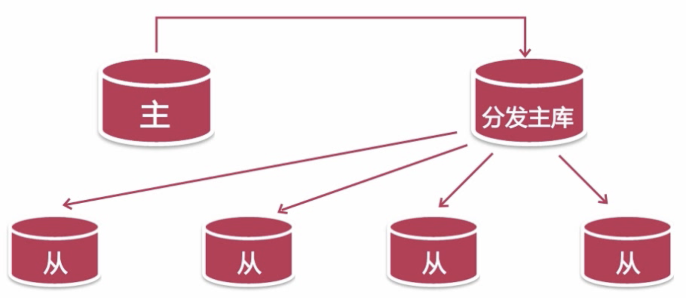
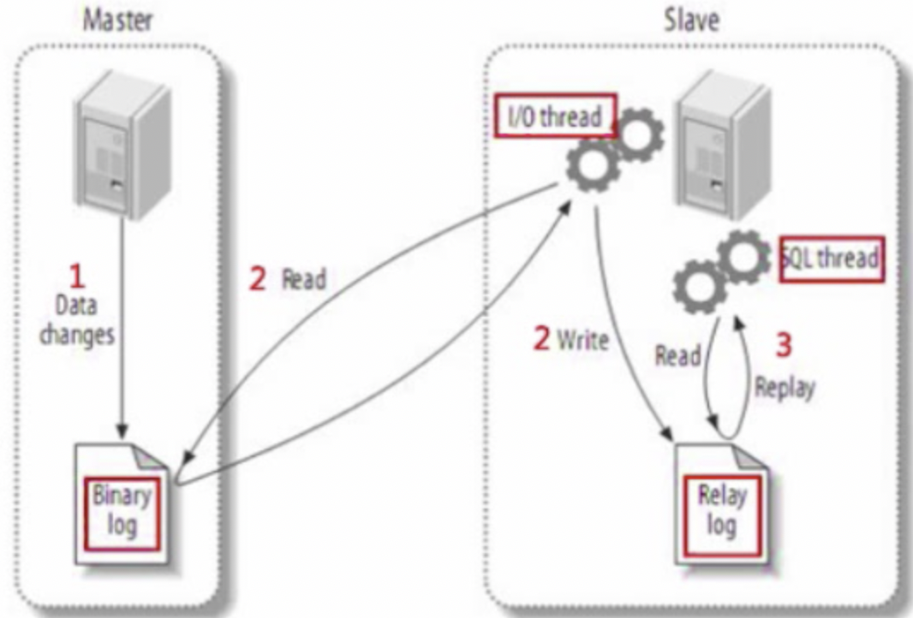

# MySQL架构

## 安装MySQL

~~~shell
# yum安装
wget https://dev.mysql.com/get/mysql57-community-release-el7-11.noarch.rpm
yum -y localinstall mysql57-community-release-el7-11.noarch.rpm
yum -y install mysql-community-server
systemctl enable mysqld
systemctl start mysqld
# 修改密码，在下面日志文件中找到 A temporary password is generated for root@localhost:
vim /var/log/mysqld.log
mysql -uroot -p
# 修改密码
ALTER USER 'root'@'localhost' IDENTIFIED BY 'CoCo@9535';
# 增加访问权限，'root'@'%'表示允许所有主机访问
grant all privileges on *.* to 'root'@'%' identified by 'CoCo@9535' with grant option;
flush privileges;

# 自定义mysql目录需要加入mysql用户组，安装后mysql用户组已经存在，加入即可
chow -R mysql:mysql /home/mysql

# 卸载(通过yum安装方式的卸载)
# 查看
rpm -qa |grep -i mysql
# 将列表显示的组件卸载
yum remove mysql-*
yum remove mysql57-community-release-el7-11.noarch
# 删除相关文件
find / -name mysql
rm -rf xxx
# 删除配置文件
rm -rf /etc/my.cnf
# 如果不删除这个文件，会导致新安装的mysql无法生存新密码，导致无法登陆
rm -rf /var/log/mysqld.log
~~~

~~~ini
vim /etc/my.cnf
[client]
port = 3306
socket = /home/mysql/data/mysql.sock

[mysqld]
# general #
user = mysql
default_storage_engine = InnoDB
socket=/home/mysql/data/mysql.sock
pid-file=/home/mysql/data/mysqld.pid
# Disabling symbolic-links is recommended to prevent assorted security risks
symbolic-links=0
basedir=/home/mysql
#datadir=/home/mysql/data
tmpdir=/home/mysql/data/tmp
log-error=/home/mysql/mysqld.log
read_only=on

# binlog #
log_bin = /home/mysql/sql_log/mysql-bin
max_binlog_size = 1000M
binlog_format = row
expire_logs_days = 7
sync_binlog = 1

# # general # 
explicit_defaults_for_timestamp = off

# replica #
server_id = 102
relay_log = /home/mysql/sql_log/mysqld-relay-bin
master_info_repository = TABLE
relay_log_info_repository = TABLE
gtid_mode = on
enforce-gtid-consistency = on
~~~

## MySQL高可用架构设计

### 如何实现高可用

避免导致系统不可用的因素，减少系统不可用的时间

1. 建立完善的监控以及报警系统
2. 对备份数据进行恢复测试
3. 正确配置数据库环境
4. 对不需要的数据进行归档和清理

增加冗余，保证系统不可用时可以尽快恢复

1. 避免存在单点故障
2. 主从切换以及故障转移

备份：

~~~shell
# 导出
mysqldump --single-transaction --master-data --triggers --routines --all-databases -uroot -p >> /root/all.sql
# 导入
mysql -uroot -p < /root/all.sql
~~~

Tip: 

* 生成环境中推荐使用xtrabackup工具来备份
* 如果主从数据库版本一致，则可以备份所有的数据库，如果版本不一致，只备份业务数据库，系统数据库可能不一样

### 基于GTID复制

GTID即全局事务ID，其保证为每一个在主库上提交的事务在复制集群中可以生成一个唯一的ID。

GTID = source_id:transcation_id，source_id是主库的UUID

从库会告知主库已经执行了的事务的GTID，然后主库会将从库为执行事务的GTID发送给从库。

**同一个事务只在指定的从库上执行一次**

复制的步骤：

1. 在主库上建立复制账号，不要在从库上手动建立相同账号

~~~sql
create user 'replication'@'172.17.227.%' identified by 'PassW0rd';
grant replication slave on *.* to 'replication'@'172.17.227.%';
~~~

2. 配置主库

   注：使用`enforce-gtid-consistency`后，下面操作将无法使用或者会报错

   * create table ... select
   * 在事务中使用create temporary table 建立临时表
   * 使用关联更新事务表和非事务表

~~~shell
# 尽量让日志和数据分开存储
bin_log = /user/local/mysql/log/mysql-bin
server_id = 100
gtid_mode = on
enforce-gtid-consistency
# 5.7版本后不需要
log-slave-updates = on	
~~~

3. 配置从库

~~~shell
server_id = 101
relay_log = /usr/local/mysql/log/relay_log
gtid_mode = on
enforce-gtid-consistency = on
# 建议配置
read_only = on
# 将信息存储在特定的使用InnoDB引擎表中，而非文件中，能够在一定程度上保证从库崩溃后可以恢复数据
master_info_repository = TABLE
relay_log_info_repository = TABLE
~~~

4. 初始化从服务器数据库 ，记录备份时最后一条事务的GTID

~~~sql
# 主库导出备份
mysqldump --single-transaction --master-data=2 --triggers --routines --all-databases -uroot -p >> /root/all.sql
# 从库导入备份
mysql -uroot -p < /root/all.sql

# 生成环境使用InnoDB则推荐使用xtrabackup，不会阻塞主库
xtrabackup --slave-info
~~~

5. 启动基于GTID的复制，在从节点上执行以下命令

~~~sql
CHANGE MASTER TO MASTER_HOST='172.17.227.75', MASTER_USER='replication', MASTER_PASSWORD='PassW0rd', MASTER_AUTO_POSITION=1;

# 启动主从复制
start slave;
# 检查是否启动成功
show slave status \G
~~~

#### 优缺点

优点：

* 相较于基于日志点复制，可以很方便的进行故障转移；

  因为可以根据全局唯一的GTID就能知道从库有哪些事务没有执行过。

* 从库不会丢失主库上的任何修改（前提是在复制前主库上binlog没有丢失）；

缺点：

* 故障处理比较复杂，比如复制时在从库上出现主键重复，需要在从库上插入空事务才能跳过这种错误
* 对执行的SQL有一定的限制

选择复制模式要考虑的问题

1. 所使用的mysql版本，基于GTID复制在5.6版本以上才支持

2. 复制架构以及主从切换的方式

3. 所使用的高可用管理组件

   MMM只支持基于日志点复制方式，MHA支持基于日志点复制和GTID复制方式

4. 对应用的支持程度

   使用基于GTID复制方式，部分SQL的执行受到限制

### MySQL复制拓扑

5.7版本后支持一从多主复制结构

#### 一主多从的复制拓扑

优点：

* 配置简单
* 可以用多个从库分担读负载

用途：

* 为不同业务使用不同的从库
* 将一台从库放到远程IDC，用作灾备恢复
* 分担主库的读负载

#### 双主复制复制拓扑

双主复制可以分为主备模式和主主模式，其中主主模式并不能分担写负载。

主主模式下的双主复制的配置注意事项：

* 这种模式容易产生数据冲突而造成复制链路的中断

* 通常用于多地多中心，需要保存对方的数据

* 两个主库中所操作的表最好能够分开，能够尽量避免数据的冲突

*  使用下面两个参数控制自增ID的生成

  ~~~shell
  # 设置自增ID自增步长
  auto_increment_increment = 2
  # 分别在两个主库中设置自增ID的起始值
  auto_increment_offset = 1|2
  ~~~

主备模式下的双主复制的配置注意事项：

* 只有一台主节点对外提供服务，另一台处于只读状态并且只作为热备使用
* 确保两台节点上的初始数据相同
* 确保两台节点上已经启动binlog，并且有不同的server_id
* 在两个节点上启用log_slave_updates参数
* 在初始的备库上启用read_only

#### 拥有备库的双主复制拓扑

 每个主节点有属于自己的从节点，如果有一个主节点下线，那么也要将其从节点从读集群中剔除，防止读数据不一致

#### 级联复制

每一个从节点都会在主节点上开启一个mysqldump线程，如果从节点太多线程数量变多，同时也增加主节点的网络负载。

因此可以增加为一个主节点增加分发节点，来分担主库的分发压力。

要在分发主库上启用`slave_log_updates`.

### MySQL复制性能优化

影响主从延迟的因素

* 主库写入binlog的时间。

  优化：控制主库的事务大小，分割大事务

* binlog传输时间，由于大多情况下时内网通信，主要影响binlog传输时间的因素时binlog的大小

  优化：使用MIXED日志格式或者设置`set binlog_row_image=minimal`来减少binlog大小

* 默认情况下从库只有一个SQL线程，主库上并发的修改在从库上变成了串行。

  在高并发或者存在大事务的情况下，复制会有较高的延迟

  优化：多线程复制

  * 在mysql5.7中可以按照逻辑时钟的方式来分配SQL线程

  配置多线程复制

  ~~~sql
  # 在从节点上操作
  stop slave;
  # 查看slave状态
  show slave status \G
  # 查看多线程复制类型，默认是database
  show variables like 'slave_parallel_type';
  set global slave_parallel_type = 'logical_clock';
  # 查看并发线程数
  show variables like 'slave_parallel_workers';
  set global slave_parallel_workers = 4;
  start slave;
  ~~~

### MySQL复制常见问题处理

由于数据损坏或丢失所引起的主从复制错误

* 主库或从库意外宕机

  如果`sync_binlog`没有设置为1时，如果主库意外宕机，此时可能就没有将最后的binlog事件刷到磁盘上。 主库重启后从库复制时可能读取不到主库上偏移量对应的binlog事件，从而导致复制链路中断。

  处理：

  * 使用跳过binlog事件
  * 注入空事务的方式先恢复中断的复制链路，再使用其他方法来对比主从服务器上的数据

  如果从库意外宕机，master_info可能没及时刷到磁盘上，从库重启后可能会重复读取主库上的binlog事件

* 主库上的二进制日志损坏

  主库重启后会重新生成一个binlog，如果前一个binlog意外损坏，从库可以通过`change master`命令来重新指定同步的binlog，但是没读取前一个binlog，可能会丢失更新。还需要恢复数据，并检验。

  从库意外宕机重启可能会使relay_log损坏，只要主库的binlog没问题，就可以通过`change master`命令指定从库的IO线程重新从损坏的地方进行同步。

在从库上进行数据修改造成的主从复制错误

* 对从库设置`read_only`

server_id或server_uuid不唯一，多个从数据库使用同一个server_uuid的问题，会造成从库丢失或者重复读取数据。

主从节点上`max_allow_packet`设置不一致引起的主从复制错误

#### MySQL复制无法解决的问题

* 分担主数据库的写负载，需要通过分库分表来解决
* 自动进行故障转移以及主从切换
* 读写分离功能

### MHA(Master High Availability)

​		在mysql**主从复制架构**中，通过从节点作为备用主节点，在主节点发生故障时，完成主节点的故障转移，并且最大程度保证数据一致性。

作用：

* 监控主节点是否可用

* 当主节点不可用时，从多个从节点中选举出新的主节点

* 提供了主从切换和故障转移功能

  在故障的主节点上保存binlog，并且最大程度上保证事务的不丢失。如果主节点硬件或者网络发生故障，无法通过ssh访问主节点，那么很可能就无法保存binlog，故障转移后会丢失一些数据

MHA可以与半同步复制结合，只要有一个从节点保存了最新的binlog，MHA就可以将最新的binlog用于其他的从节点上，可以保证多节点的数据一致性。

MHA主从切换过程

1. MHA自动识别主节点并对其进行监控，当发现主节点发生故障时，会尝试通过ssh连接保存binlog(这是与MMM最大不同的地方，MMM在主节点故障时并不会保存binlog)；

2. 从多个备选从节点中选举出与原主节点数据最接近的从节点，作为新的备选主节点（可以通过配置指定一些服务器不参与选举）；

3. 在备选主节点和其他从节点进行数据同步；

4. 应用从原主节点上保存的binlog；

   ⚠️注意：如果存在重复的主键等会使MHA停止进行故障转移；

5. 提升备选主节点为新的主节点，并完成VIP切换；

6. 将其他的从节点迁移为新主节点的从节点；

MHA支持基于**日志点**的复制和基于**GTID**主从复制方式。 

**推荐使用GTID复制方式**，更安全，且不会出现重复回放日志的情况。

MHA配置步骤

* 配置集群内所有主机的SSH免认证登录

  故障转移过程中保存原主节点的二进制日志、配置VIP地址等需要SSH登录

* 安装MHA- node软件包(所有集群节点)和MHA- manager软件包(监控节点)

* 建立主从复制集群

* 配置MHA管理节点

* 使用`masterha_check_ssh`(检测ssh免认证配置)和`masterha_chech_repl`(检测集群中各节点的复制链路)对配置进行验证

* 启动并测试MHA服务

环境

| master        | slave-1       | slave-2       | monitor       | VIP           |
| ------------- | ------------- | ------------- | ------------- | ------------- |
| 172.17.227.75 | 172.17.227.74 | 172.17.227.73 | 172.17.227.73 | 172.17.227.70 |

1. 配置集群内所有主机的SSH免认证登录，下面命令每个主机节点都要执行一遍

~~~shell
ssh-keygen
ssh-copy-id -i /root/.ssh/id_rsa -p 22 root@172.17.227.75
ssh-copy-id -i /root/.ssh/id_rsa -p 22 root@172.17.227.74
ssh-copy-id -i /root/.ssh/id_rsa -p 22 root@172.17.227.73
~~~

2. 安装mha相关组件

~~~shell
# mha用perl编写，需要安装perl工具包
yum -y install perl-Config-Tiny.noarch perl-Time-HiRes.x86_64 perl-Parallel-ForkManager perl-Log-Dispatch perl-DBD-MySQL ncftp

# 每个节点安装mha-node包
rpm -ivh mha4mysql-node-0.57-0.el7.noarch.rpm
# 管理节点安装mha-manager包
rpm -ivh mha4mysql-manager-0.57-0.el7.noarch.rpm
~~~

3. 在主节点建立带有全部权限的mha用户，会同步到其他节点

~~~sql
grant all privileges on *.* to mha4mysql@'172.17.227.%' identified by '123456';
~~~

4. 只需在mha管理节点上进行配置

~~~shell
# mha配置文件存储目录
mkdir -p /etc/mha
# 保存从主库下载的binlog
mkdir -p /home/mysql_mha

# mha配置文件
vim /etc/mha/mysql_mha.cnf
[server default]
# 要在数据库建立的用于mha主从管理的数据库用户
user=mha4mysql
password=123456
# mha工作目录，要提前创建
manager_workdir=/home/mysql_mha
manager_log=/home/mysql_mha/manager.log
remote_workdir=/home/mysql_mha
ssh_user=root
repl_user=replication
repl_password=PassW0rd
# manager监测主节点是否存活的时间间隔，单位秒
ping_interval=1
# 指定主节点配置的binlog目录，manager从这个目录中下载binlog
master_binlog_dir=/home/mysql/sql_log
# 故障转移的ip切换脚本
master_ip_failover_script=/usr/bin/master_ip_failover
secondary_check_script=/usr/bin/masterha_secondary_check -s 172.17.227.75 -s 172.17.227.74 -s 172.17.227.73
[server1]
hostname=172.17.227.75
# 参与主节点选举
candidate_master=1
[server2]
hostname=172.17.227.74
candidate_master=1
[server3]
hostname=172.17.227.73
# 不参与主节点选举
no_master=1

# failover脚本
vim /usr/bin/master_ip_failover

#!/usr/bin/env perl
use strict;
use warnings FATAL =>'all';

use Getopt::Long;

my (
$command,          $ssh_user,        $orig_master_host, $orig_master_ip,
$orig_master_port, $new_master_host, $new_master_ip,    $new_master_port
);

my $vip = '172.17.227.70/20';  # Virtual IP
my $key = "1";
my $ssh_start_vip = "/sbin/ifconfig eth0:$key $vip";
my $ssh_stop_vip = "/sbin/ifconfig eth0:$key down";
my $exit_code = 0;

GetOptions(
'command=s'          => \$command,
'ssh_user=s'         => \$ssh_user,
'orig_master_host=s' => \$orig_master_host,
'orig_master_ip=s'   => \$orig_master_ip,
'orig_master_port=i' => \$orig_master_port,
'new_master_host=s'  => \$new_master_host,
'new_master_ip=s'    => \$new_master_ip,
'new_master_port=i'  => \$new_master_port,
);

exit &main();

sub main {

#print "\n\nIN SCRIPT TEST====$ssh_stop_vip==$ssh_start_vip===\n\n";

if ( $command eq "stop" || $command eq "stopssh" ) {

        # $orig_master_host, $orig_master_ip, $orig_master_port are passed.
        # If you manage master ip address at global catalog database,
        # invalidate orig_master_ip here.
        my $exit_code = 1;
        eval {
            print "\n\n\n***************************************************************\n";
            print "Disabling the VIP - $vip on old master: $orig_master_host\n";
            print "***************************************************************\n\n\n\n";
&stop_vip();
            $exit_code = 0;
        };
        if ($@) {
            warn "Got Error: $@\n";
            exit $exit_code;
        }
        exit $exit_code;
}
elsif ( $command eq "start" ) {

        # all arguments are passed.
        # If you manage master ip address at global catalog database,
        # activate new_master_ip here.
        # You can also grant write access (create user, set read_only=0, etc) here.
				my $exit_code = 10;
        eval {
            print "\n\n\n***************************************************************\n";
            print "Enabling the VIP - $vip on new master: $new_master_host \n";
            print "***************************************************************\n\n\n\n";
						&start_vip();
            $exit_code = 0;
        };
        if ($@) {
            warn $@;
            exit $exit_code;
        }
        exit $exit_code;
}
elsif ( $command eq "status" ) {
        print "Checking the Status of the script.. OK \n";
        `ssh $ssh_user\@$orig_master_host \" $ssh_start_vip \"`;
        exit 0;
}
else {
  &usage();
          exit 1;
  }
}

# A simple system call that enable the VIP on the new master
sub start_vip() {
	`ssh $ssh_user\@$new_master_host \" $ssh_start_vip \"`;
}
# A simple system call that disable the VIP on the old_master
sub stop_vip() {
	`ssh $ssh_user\@$orig_master_host \" $ssh_stop_vip \"`;
}

sub usage {
  print
  "Usage: master_ip_failover –command=start|stop|stopssh|status –orig_master_host=host –orig_master_ip=ip –orig_master_port=port –new_master_host=host –new_master_ip=ip –new_master_port=port\n";
}

# 给master_ip_failover赋予执行权限，否则配置检查会报错
chmod +x /usr/bin/master_ip_failover
~~~

5. 验证配置

~~~shell
# ssh配置检测
masterha_check_ssh --conf=/etc/mha/mysql_mha.cnf

# 基础配置检测
masterha_check_repl --conf=/etc/mha/mysql_mha.cnf
~~~

6. 启动mha

~~~shell
nohup masterha_manager --conf=/etc/mha/mysql_mha.cnf &

# 查看mha状态
masterha_check_status --conf=/etc/mha/mysql_mha.cnf
# 停止mha
masterha_stop --conf=/etc/mha/mysql_mha.cnf
~~~

7. 手动配置默认主节点的vip，之后故障迁移会自动切换

~~~shell
# 掩码要与当前网卡(这里是eth0)一样
ifconfig eth0:1 172.17.227.70 netmask 255.255.240.0 up
# 或者
ifconfig eth0:1 172.17.227.70/20

# 查看
ip addr
~~~

failover成功日志：

~~~log
Wed Sep  1 10:01:15 2021 - [warning] Got error on MySQL select ping: 2013 (Lost connection to MySQL server during query)
Wed Sep  1 10:01:15 2021 - [info] Executing secondary network check script: /usr/bin/masterha_secondary_check -s 172.17.227.75 -s 172.17.227.74 -s 172.17.227.73  --user=root  --master_host=172.17.227.75  --master_ip=172.17.227.75  --master_port=3306 --master_user=mha4mysql --master_password=123456 --ping_type=SELECT
Wed Sep  1 10:01:15 2021 - [info] Executing SSH check script: exit 0
Wed Sep  1 10:01:15 2021 - [info] HealthCheck: SSH to 172.17.227.75 is reachable.
Monitoring server 172.17.227.75 is reachable, Master is not reachable from 172.17.227.75. OK.
Monitoring server 172.17.227.74 is reachable, Master is not reachable from 172.17.227.74. OK.
Monitoring server 172.17.227.73 is reachable, Master is not reachable from 172.17.227.73. OK.
Wed Sep  1 10:01:15 2021 - [info] Master is not reachable from all other monitoring servers. Failover should start.
Wed Sep  1 10:01:16 2021 - [warning] Got error on MySQL connect: 2003 (Can't connect to MySQL server on '172.17.227.75' (111))
Wed Sep  1 10:01:16 2021 - [warning] Connection failed 2 time(s)..
Wed Sep  1 10:01:17 2021 - [warning] Got error on MySQL connect: 2003 (Can't connect to MySQL server on '172.17.227.75' (111))
Wed Sep  1 10:01:17 2021 - [warning] Connection failed 3 time(s)..
Wed Sep  1 10:01:18 2021 - [warning] Got error on MySQL connect: 2003 (Can't connect to MySQL server on '172.17.227.75' (111))
Wed Sep  1 10:01:18 2021 - [warning] Connection failed 4 time(s)..
Wed Sep  1 10:01:18 2021 - [warning] Master is not reachable from health checker!
Wed Sep  1 10:01:18 2021 - [warning] Master 172.17.227.75(172.17.227.75:3306) is not reachable!
Wed Sep  1 10:01:18 2021 - [warning] SSH is reachable.
Wed Sep  1 10:01:18 2021 - [info] Connecting to a master server failed. Reading configuration file /etc/masterha_default.cnf and /etc/mha/mysql_mha.cnf again, and trying to connect to all servers to check server status..
Wed Sep  1 10:01:18 2021 - [warning] Global configuration file /etc/masterha_default.cnf not found. Skipping.
Wed Sep  1 10:01:18 2021 - [info] Reading application default configuration from /etc/mha/mysql_mha.cnf..
Wed Sep  1 10:01:18 2021 - [info] Reading server configuration from /etc/mha/mysql_mha.cnf..
Wed Sep  1 10:01:19 2021 - [info] GTID failover mode = 1
Wed Sep  1 10:01:19 2021 - [info] Dead Servers:
Wed Sep  1 10:01:19 2021 - [info]   172.17.227.75(172.17.227.75:3306)
Wed Sep  1 10:01:19 2021 - [info] Alive Servers:
Wed Sep  1 10:01:19 2021 - [info]   172.17.227.74(172.17.227.74:3306)
Wed Sep  1 10:01:19 2021 - [info]   172.17.227.73(172.17.227.73:3306)
Wed Sep  1 10:01:19 2021 - [info] Alive Slaves:
Wed Sep  1 10:01:19 2021 - [info]   172.17.227.74(172.17.227.74:3306)  Version=5.7.35-log (oldest major version between slaves) log-bin:enabled
Wed Sep  1 10:01:19 2021 - [info]     GTID ON
Wed Sep  1 10:01:19 2021 - [info]     Replicating from 172.17.227.75(172.17.227.75:3306)
Wed Sep  1 10:01:19 2021 - [info]     Primary candidate for the new Master (candidate_master is set)
Wed Sep  1 10:01:19 2021 - [info]   172.17.227.73(172.17.227.73:3306)  Version=5.7.35-log (oldest major version between slaves) log-bin:enabled
Wed Sep  1 10:01:19 2021 - [info]     GTID ON
Wed Sep  1 10:01:19 2021 - [info]     Replicating from 172.17.227.75(172.17.227.75:3306)
Wed Sep  1 10:01:19 2021 - [info]     Not candidate for the new Master (no_master is set)
Wed Sep  1 10:01:19 2021 - [info] Checking slave configurations..
Wed Sep  1 10:01:19 2021 - [info] Checking replication filtering settings..
Wed Sep  1 10:01:19 2021 - [info]  Replication filtering check ok.
Wed Sep  1 10:01:19 2021 - [info] Master is down!
Wed Sep  1 10:01:19 2021 - [info] Terminating monitoring script.
Wed Sep  1 10:01:19 2021 - [info] Got exit code 20 (Master dead).
Wed Sep  1 10:01:19 2021 - [info] MHA::MasterFailover version 0.57.
Wed Sep  1 10:01:19 2021 - [info] Starting master failover.
Wed Sep  1 10:01:19 2021 - [info] 
Wed Sep  1 10:01:19 2021 - [info] * Phase 1: Configuration Check Phase..
Wed Sep  1 10:01:19 2021 - [info] 
Wed Sep  1 10:01:20 2021 - [info] GTID failover mode = 1
Wed Sep  1 10:01:20 2021 - [info] Dead Servers:
Wed Sep  1 10:01:20 2021 - [info]   172.17.227.75(172.17.227.75:3306)
Wed Sep  1 10:01:20 2021 - [info] Checking master reachability via MySQL(double check)...
Wed Sep  1 10:01:20 2021 - [info]  ok.
Wed Sep  1 10:01:20 2021 - [info] Alive Servers:
Wed Sep  1 10:01:20 2021 - [info]   172.17.227.74(172.17.227.74:3306)
Wed Sep  1 10:01:20 2021 - [info]   172.17.227.73(172.17.227.73:3306)
Wed Sep  1 10:01:20 2021 - [info] Alive Slaves:
Wed Sep  1 10:01:20 2021 - [info]   172.17.227.74(172.17.227.74:3306)  Version=5.7.35-log (oldest major version between slaves) log-bin:enabled
Wed Sep  1 10:01:20 2021 - [info]     GTID ON
Wed Sep  1 10:01:20 2021 - [info]     Replicating from 172.17.227.75(172.17.227.75:3306)
Wed Sep  1 10:01:20 2021 - [info]     Primary candidate for the new Master (candidate_master is set)
Wed Sep  1 10:01:20 2021 - [info]   172.17.227.73(172.17.227.73:3306)  Version=5.7.35-log (oldest major version between slaves) log-bin:enabled
Wed Sep  1 10:01:20 2021 - [info]     GTID ON
Wed Sep  1 10:01:20 2021 - [info]     Replicating from 172.17.227.75(172.17.227.75:3306)
Wed Sep  1 10:01:20 2021 - [info]     Not candidate for the new Master (no_master is set)
Wed Sep  1 10:01:20 2021 - [info] Starting GTID based failover.
Wed Sep  1 10:01:20 2021 - [info] 
Wed Sep  1 10:01:20 2021 - [info] ** Phase 1: Configuration Check Phase completed.
Wed Sep  1 10:01:20 2021 - [info] 
Wed Sep  1 10:01:20 2021 - [info] * Phase 2: Dead Master Shutdown Phase..
Wed Sep  1 10:01:20 2021 - [info] 
Wed Sep  1 10:01:20 2021 - [info] Forcing shutdown so that applications never connect to the current master..
Wed Sep  1 10:01:20 2021 - [info] Executing master IP deactivation script:
Wed Sep  1 10:01:20 2021 - [info]   /usr/bin/master_ip_failover --orig_master_host=172.17.227.75 --orig_master_ip=172.17.227.75 --orig_master_port=3306 --command=stopssh --ssh_user=root  

***************************************************************
Disabling the VIP - 172.17.227.70/20 on old master: 172.17.227.75
***************************************************************

Wed Sep  1 10:01:20 2021 - [info]  done.
Wed Sep  1 10:01:20 2021 - [warning] shutdown_script is not set. Skipping explicit shutting down of the dead master.
Wed Sep  1 10:01:20 2021 - [info] * Phase 2: Dead Master Shutdown Phase completed.
Wed Sep  1 10:01:20 2021 - [info] 
Wed Sep  1 10:01:20 2021 - [info] * Phase 3: Master Recovery Phase..
Wed Sep  1 10:01:20 2021 - [info] 
Wed Sep  1 10:01:20 2021 - [info] * Phase 3.1: Getting Latest Slaves Phase..
Wed Sep  1 10:01:20 2021 - [info] 
Wed Sep  1 10:01:20 2021 - [info] The latest binary log file/position on all slaves is mysql-bin.000028:110379
Wed Sep  1 10:01:20 2021 - [info] Retrieved Gtid Set: 56b585bd-071e-11ec-86d3-00163e16c215:73-74
Wed Sep  1 10:01:20 2021 - [info] Latest slaves (Slaves that received relay log files to the latest):
Wed Sep  1 10:01:20 2021 - [info]   172.17.227.74(172.17.227.74:3306)  Version=5.7.35-log (oldest major version between slaves) log-bin:enabled
Wed Sep  1 10:01:20 2021 - [info]     GTID ON
Wed Sep  1 10:01:20 2021 - [info]     Replicating from 172.17.227.75(172.17.227.75:3306)
Wed Sep  1 10:01:20 2021 - [info]     Primary candidate for the new Master (candidate_master is set)
Wed Sep  1 10:01:20 2021 - [info]   172.17.227.73(172.17.227.73:3306)  Version=5.7.35-log (oldest major version between slaves) log-bin:enabled
Wed Sep  1 10:01:20 2021 - [info]     GTID ON
Wed Sep  1 10:01:20 2021 - [info]     Replicating from 172.17.227.75(172.17.227.75:3306)
Wed Sep  1 10:01:20 2021 - [info]     Not candidate for the new Master (no_master is set)
Wed Sep  1 10:01:20 2021 - [info] The oldest binary log file/position on all slaves is mysql-bin.000028:110379
Wed Sep  1 10:01:20 2021 - [info] Retrieved Gtid Set: 56b585bd-071e-11ec-86d3-00163e16c215:73-74
Wed Sep  1 10:01:20 2021 - [info] Oldest slaves:
Wed Sep  1 10:01:20 2021 - [info]   172.17.227.74(172.17.227.74:3306)  Version=5.7.35-log (oldest major version between slaves) log-bin:enabled
Wed Sep  1 10:01:20 2021 - [info]     GTID ON
Wed Sep  1 10:01:20 2021 - [info]     Replicating from 172.17.227.75(172.17.227.75:3306)
Wed Sep  1 10:01:20 2021 - [info]     Primary candidate for the new Master (candidate_master is set)
Wed Sep  1 10:01:20 2021 - [info]   172.17.227.73(172.17.227.73:3306)  Version=5.7.35-log (oldest major version between slaves) log-bin:enabled
Wed Sep  1 10:01:20 2021 - [info]     GTID ON
Wed Sep  1 10:01:20 2021 - [info]     Replicating from 172.17.227.75(172.17.227.75:3306)
Wed Sep  1 10:01:20 2021 - [info]     Not candidate for the new Master (no_master is set)
Wed Sep  1 10:01:20 2021 - [info] 
Wed Sep  1 10:01:20 2021 - [info] * Phase 3.3: Determining New Master Phase..
Wed Sep  1 10:01:20 2021 - [info] 
Wed Sep  1 10:01:20 2021 - [info] Searching new master from slaves..
Wed Sep  1 10:01:20 2021 - [info]  Candidate masters from the configuration file:
Wed Sep  1 10:01:20 2021 - [info]   172.17.227.74(172.17.227.74:3306)  Version=5.7.35-log (oldest major version between slaves) log-bin:enabled
Wed Sep  1 10:01:20 2021 - [info]     GTID ON
Wed Sep  1 10:01:20 2021 - [info]     Replicating from 172.17.227.75(172.17.227.75:3306)
Wed Sep  1 10:01:20 2021 - [info]     Primary candidate for the new Master (candidate_master is set)
Wed Sep  1 10:01:20 2021 - [info]  Non-candidate masters:
Wed Sep  1 10:01:20 2021 - [info]   172.17.227.73(172.17.227.73:3306)  Version=5.7.35-log (oldest major version between slaves) log-bin:enabled
Wed Sep  1 10:01:20 2021 - [info]     GTID ON
Wed Sep  1 10:01:20 2021 - [info]     Replicating from 172.17.227.75(172.17.227.75:3306)
Wed Sep  1 10:01:20 2021 - [info]     Not candidate for the new Master (no_master is set)
Wed Sep  1 10:01:20 2021 - [info]  Searching from candidate_master slaves which have received the latest relay log events..
Wed Sep  1 10:01:20 2021 - [info] New master is 172.17.227.74(172.17.227.74:3306)
Wed Sep  1 10:01:20 2021 - [info] Starting master failover..
Wed Sep  1 10:01:20 2021 - [info] 
From:
172.17.227.75(172.17.227.75:3306) (current master)
 +--172.17.227.74(172.17.227.74:3306)
 +--172.17.227.73(172.17.227.73:3306)

To:
172.17.227.74(172.17.227.74:3306) (new master)
 +--172.17.227.73(172.17.227.73:3306)
Wed Sep  1 10:01:20 2021 - [info] 
Wed Sep  1 10:01:20 2021 - [info] * Phase 3.3: New Master Recovery Phase..
Wed Sep  1 10:01:20 2021 - [info] 
Wed Sep  1 10:01:20 2021 - [info]  Waiting all logs to be applied.. 
Wed Sep  1 10:01:20 2021 - [info]   done.
Wed Sep  1 10:01:20 2021 - [info] Getting new master's binlog name and position..
Wed Sep  1 10:01:20 2021 - [info]  mysql-bin.000001:154
Wed Sep  1 10:01:20 2021 - [info]  All other slaves should start replication from here. Statement should be: CHANGE MASTER TO MASTER_HOST='172.17.227.74', MASTER_PORT=3306, MASTER_AUTO_POSITION=1, MASTER_USER='replication', MASTER_PASSWORD='xxx';
Wed Sep  1 10:01:20 2021 - [info] Master Recovery succeeded. File:Pos:Exec_Gtid_Set: mysql-bin.000001, 154, 56b585bd-071e-11ec-86d3-00163e16c215:1-74
Wed Sep  1 10:01:20 2021 - [info] Executing master IP activate script:
Wed Sep  1 10:01:20 2021 - [info]   /usr/bin/master_ip_failover --command=start --ssh_user=root --orig_master_host=172.17.227.75 --orig_master_ip=172.17.227.75 --orig_master_port=3306 --new_master_host=172.17.227.74 --new_master_ip=172.17.227.74 --new_master_port=3306 --new_master_user='mha4mysql'   --new_master_password=xxx
Unknown option: new_master_user
Unknown option: new_master_password

***************************************************************
Enabling the VIP - 172.17.227.70/20 on new master: 172.17.227.74 
***************************************************************

Wed Sep  1 10:01:20 2021 - [info]  OK.
2021-09-01 10:41:34 重新连接成功!
Last login: Wed Sep  1 10:41:31 2021 from 100.104.228.150

Welcome to Alibaba Cloud Elastic Compute Service !

[root@hzd-slave2 ~]# tail -500 /home/mysql_mha/m
manager.log                  mysql_mha.failover.complete  
[root@hzd-slave2 ~]# tail -500 /home/mysql_mha/manager.log 
Wed Sep  1 10:00:37 2021 - [info] MHA::MasterMonitor version 0.57.
Wed Sep  1 10:00:38 2021 - [info] GTID failover mode = 1
Wed Sep  1 10:00:38 2021 - [info] Dead Servers:
Wed Sep  1 10:00:38 2021 - [info] Alive Servers:
Wed Sep  1 10:00:38 2021 - [info]   172.17.227.75(172.17.227.75:3306)
Wed Sep  1 10:00:38 2021 - [info]   172.17.227.74(172.17.227.74:3306)
Wed Sep  1 10:00:38 2021 - [info]   172.17.227.73(172.17.227.73:3306)
Wed Sep  1 10:00:38 2021 - [info] Alive Slaves:
Wed Sep  1 10:00:38 2021 - [info]   172.17.227.74(172.17.227.74:3306)  Version=5.7.35-log (oldest major version between slaves) log-bin:enabled
Wed Sep  1 10:00:38 2021 - [info]     GTID ON
Wed Sep  1 10:00:38 2021 - [info]     Replicating from 172.17.227.75(172.17.227.75:3306)
Wed Sep  1 10:00:38 2021 - [info]     Primary candidate for the new Master (candidate_master is set)
Wed Sep  1 10:00:38 2021 - [info]   172.17.227.73(172.17.227.73:3306)  Version=5.7.35-log (oldest major version between slaves) log-bin:enabled
Wed Sep  1 10:00:38 2021 - [info]     GTID ON
Wed Sep  1 10:00:38 2021 - [info]     Replicating from 172.17.227.75(172.17.227.75:3306)
Wed Sep  1 10:00:38 2021 - [info]     Not candidate for the new Master (no_master is set)
Wed Sep  1 10:00:38 2021 - [info] Current Alive Master: 172.17.227.75(172.17.227.75:3306)
Wed Sep  1 10:00:38 2021 - [info] Checking slave configurations..
Wed Sep  1 10:00:38 2021 - [info] Checking replication filtering settings..
Wed Sep  1 10:00:38 2021 - [info]  binlog_do_db= , binlog_ignore_db= 
Wed Sep  1 10:00:38 2021 - [info]  Replication filtering check ok.
Wed Sep  1 10:00:38 2021 - [info] GTID (with auto-pos) is supported. Skipping all SSH and Node package checking.
Wed Sep  1 10:00:38 2021 - [info] Checking SSH publickey authentication settings on the current master..
Wed Sep  1 10:00:38 2021 - [info] HealthCheck: SSH to 172.17.227.75 is reachable.
Wed Sep  1 10:00:38 2021 - [info] 
172.17.227.75(172.17.227.75:3306) (current master)
 +--172.17.227.74(172.17.227.74:3306)
 +--172.17.227.73(172.17.227.73:3306)

Wed Sep  1 10:00:38 2021 - [info] Checking master_ip_failover_script status:
Wed Sep  1 10:00:38 2021 - [info]   /usr/bin/master_ip_failover --command=status --ssh_user=root --orig_master_host=172.17.227.75 --orig_master_ip=172.17.227.75 --orig_master_port=3306 
Checking the Status of the script.. OK 
Wed Sep  1 10:00:38 2021 - [info]  OK.
Wed Sep  1 10:00:38 2021 - [warning] shutdown_script is not defined.
Wed Sep  1 10:00:38 2021 - [info] Set master ping interval 1 seconds.
Wed Sep  1 10:00:38 2021 - [info] Set secondary check script: /usr/bin/masterha_secondary_check -s 172.17.227.75 -s 172.17.227.74 -s 172.17.227.73
Wed Sep  1 10:00:38 2021 - [info] Starting ping health check on 172.17.227.75(172.17.227.75:3306)..
Wed Sep  1 10:00:38 2021 - [info] Ping(SELECT) succeeded, waiting until MySQL doesn't respond..
Wed Sep  1 10:01:15 2021 - [warning] Got error on MySQL select ping: 2013 (Lost connection to MySQL server during query)
Wed Sep  1 10:01:15 2021 - [info] Executing secondary network check script: /usr/bin/masterha_secondary_check -s 172.17.227.75 -s 172.17.227.74 -s 172.17.227.73  --user=root  --master_host=172.17.227.75  --master_ip=172.17.227.75  --master_port=3306 --master_user=mha4mysql --master_password=123456 --ping_type=SELECT
Wed Sep  1 10:01:15 2021 - [info] Executing SSH check script: exit 0
Wed Sep  1 10:01:15 2021 - [info] HealthCheck: SSH to 172.17.227.75 is reachable.
Monitoring server 172.17.227.75 is reachable, Master is not reachable from 172.17.227.75. OK.
Monitoring server 172.17.227.74 is reachable, Master is not reachable from 172.17.227.74. OK.
Monitoring server 172.17.227.73 is reachable, Master is not reachable from 172.17.227.73. OK.
Wed Sep  1 10:01:15 2021 - [info] Master is not reachable from all other monitoring servers. Failover should start.
Wed Sep  1 10:01:16 2021 - [warning] Got error on MySQL connect: 2003 (Can't connect to MySQL server on '172.17.227.75' (111))
Wed Sep  1 10:01:16 2021 - [warning] Connection failed 2 time(s)..
Wed Sep  1 10:01:17 2021 - [warning] Got error on MySQL connect: 2003 (Can't connect to MySQL server on '172.17.227.75' (111))
Wed Sep  1 10:01:17 2021 - [warning] Connection failed 3 time(s)..
Wed Sep  1 10:01:18 2021 - [warning] Got error on MySQL connect: 2003 (Can't connect to MySQL server on '172.17.227.75' (111))
Wed Sep  1 10:01:18 2021 - [warning] Connection failed 4 time(s)..
Wed Sep  1 10:01:18 2021 - [warning] Master is not reachable from health checker!
Wed Sep  1 10:01:18 2021 - [warning] Master 172.17.227.75(172.17.227.75:3306) is not reachable!
Wed Sep  1 10:01:18 2021 - [warning] SSH is reachable.
Wed Sep  1 10:01:18 2021 - [info] Connecting to a master server failed. Reading configuration file /etc/masterha_default.cnf and /etc/mha/mysql_mha.cnf again, and trying to connect to all servers to check server status..
Wed Sep  1 10:01:18 2021 - [warning] Global configuration file /etc/masterha_default.cnf not found. Skipping.
Wed Sep  1 10:01:18 2021 - [info] Reading application default configuration from /etc/mha/mysql_mha.cnf..
Wed Sep  1 10:01:18 2021 - [info] Reading server configuration from /etc/mha/mysql_mha.cnf..
Wed Sep  1 10:01:19 2021 - [info] GTID failover mode = 1
Wed Sep  1 10:01:19 2021 - [info] Dead Servers:
Wed Sep  1 10:01:19 2021 - [info]   172.17.227.75(172.17.227.75:3306)
Wed Sep  1 10:01:19 2021 - [info] Alive Servers:
Wed Sep  1 10:01:19 2021 - [info]   172.17.227.74(172.17.227.74:3306)
Wed Sep  1 10:01:19 2021 - [info]   172.17.227.73(172.17.227.73:3306)
Wed Sep  1 10:01:19 2021 - [info] Alive Slaves:
Wed Sep  1 10:01:19 2021 - [info]   172.17.227.74(172.17.227.74:3306)  Version=5.7.35-log (oldest major version between slaves) log-bin:enabled
Wed Sep  1 10:01:19 2021 - [info]     GTID ON
Wed Sep  1 10:01:19 2021 - [info]     Replicating from 172.17.227.75(172.17.227.75:3306)
Wed Sep  1 10:01:19 2021 - [info]     Primary candidate for the new Master (candidate_master is set)
Wed Sep  1 10:01:19 2021 - [info]   172.17.227.73(172.17.227.73:3306)  Version=5.7.35-log (oldest major version between slaves) log-bin:enabled
Wed Sep  1 10:01:19 2021 - [info]     GTID ON
Wed Sep  1 10:01:19 2021 - [info]     Replicating from 172.17.227.75(172.17.227.75:3306)
Wed Sep  1 10:01:19 2021 - [info]     Not candidate for the new Master (no_master is set)
Wed Sep  1 10:01:19 2021 - [info] Checking slave configurations..
Wed Sep  1 10:01:19 2021 - [info] Checking replication filtering settings..
Wed Sep  1 10:01:19 2021 - [info]  Replication filtering check ok.
Wed Sep  1 10:01:19 2021 - [info] Master is down!
Wed Sep  1 10:01:19 2021 - [info] Terminating monitoring script.
Wed Sep  1 10:01:19 2021 - [info] Got exit code 20 (Master dead).
Wed Sep  1 10:01:19 2021 - [info] MHA::MasterFailover version 0.57.
Wed Sep  1 10:01:19 2021 - [info] Starting master failover.
Wed Sep  1 10:01:19 2021 - [info] 
Wed Sep  1 10:01:19 2021 - [info] * Phase 1: Configuration Check Phase..
Wed Sep  1 10:01:19 2021 - [info] 
Wed Sep  1 10:01:20 2021 - [info] GTID failover mode = 1
Wed Sep  1 10:01:20 2021 - [info] Dead Servers:
Wed Sep  1 10:01:20 2021 - [info]   172.17.227.75(172.17.227.75:3306)
Wed Sep  1 10:01:20 2021 - [info] Checking master reachability via MySQL(double check)...
Wed Sep  1 10:01:20 2021 - [info]  ok.
Wed Sep  1 10:01:20 2021 - [info] Alive Servers:
Wed Sep  1 10:01:20 2021 - [info]   172.17.227.74(172.17.227.74:3306)
Wed Sep  1 10:01:20 2021 - [info]   172.17.227.73(172.17.227.73:3306)
Wed Sep  1 10:01:20 2021 - [info] Alive Slaves:
Wed Sep  1 10:01:20 2021 - [info]   172.17.227.74(172.17.227.74:3306)  Version=5.7.35-log (oldest major version between slaves) log-bin:enabled
Wed Sep  1 10:01:20 2021 - [info]     GTID ON
Wed Sep  1 10:01:20 2021 - [info]     Replicating from 172.17.227.75(172.17.227.75:3306)
Wed Sep  1 10:01:20 2021 - [info]     Primary candidate for the new Master (candidate_master is set)
Wed Sep  1 10:01:20 2021 - [info]   172.17.227.73(172.17.227.73:3306)  Version=5.7.35-log (oldest major version between slaves) log-bin:enabled
Wed Sep  1 10:01:20 2021 - [info]     GTID ON
Wed Sep  1 10:01:20 2021 - [info]     Replicating from 172.17.227.75(172.17.227.75:3306)
Wed Sep  1 10:01:20 2021 - [info]     Not candidate for the new Master (no_master is set)
Wed Sep  1 10:01:20 2021 - [info] Starting GTID based failover.
Wed Sep  1 10:01:20 2021 - [info] 
Wed Sep  1 10:01:20 2021 - [info] ** Phase 1: Configuration Check Phase completed.
Wed Sep  1 10:01:20 2021 - [info] 
Wed Sep  1 10:01:20 2021 - [info] * Phase 2: Dead Master Shutdown Phase..
Wed Sep  1 10:01:20 2021 - [info] 
Wed Sep  1 10:01:20 2021 - [info] Forcing shutdown so that applications never connect to the current master..
Wed Sep  1 10:01:20 2021 - [info] Executing master IP deactivation script:
Wed Sep  1 10:01:20 2021 - [info]   /usr/bin/master_ip_failover --orig_master_host=172.17.227.75 --orig_master_ip=172.17.227.75 --orig_master_port=3306 --command=stopssh --ssh_user=root  

***************************************************************
Disabling the VIP - 172.17.227.70/20 on old master: 172.17.227.75
***************************************************************

Wed Sep  1 10:01:20 2021 - [info]  done.
Wed Sep  1 10:01:20 2021 - [warning] shutdown_script is not set. Skipping explicit shutting down of the dead master.
Wed Sep  1 10:01:20 2021 - [info] * Phase 2: Dead Master Shutdown Phase completed.
Wed Sep  1 10:01:20 2021 - [info] 
Wed Sep  1 10:01:20 2021 - [info] * Phase 3: Master Recovery Phase..
Wed Sep  1 10:01:20 2021 - [info] 
Wed Sep  1 10:01:20 2021 - [info] * Phase 3.1: Getting Latest Slaves Phase..
Wed Sep  1 10:01:20 2021 - [info] 
Wed Sep  1 10:01:20 2021 - [info] The latest binary log file/position on all slaves is mysql-bin.000028:110379
Wed Sep  1 10:01:20 2021 - [info] Retrieved Gtid Set: 56b585bd-071e-11ec-86d3-00163e16c215:73-74
Wed Sep  1 10:01:20 2021 - [info] Latest slaves (Slaves that received relay log files to the latest):
Wed Sep  1 10:01:20 2021 - [info]   172.17.227.74(172.17.227.74:3306)  Version=5.7.35-log (oldest major version between slaves) log-bin:enabled
Wed Sep  1 10:01:20 2021 - [info]     GTID ON
Wed Sep  1 10:01:20 2021 - [info]     Replicating from 172.17.227.75(172.17.227.75:3306)
Wed Sep  1 10:01:20 2021 - [info]     Primary candidate for the new Master (candidate_master is set)
Wed Sep  1 10:01:20 2021 - [info]   172.17.227.73(172.17.227.73:3306)  Version=5.7.35-log (oldest major version between slaves) log-bin:enabled
Wed Sep  1 10:01:20 2021 - [info]     GTID ON
Wed Sep  1 10:01:20 2021 - [info]     Replicating from 172.17.227.75(172.17.227.75:3306)
Wed Sep  1 10:01:20 2021 - [info]     Not candidate for the new Master (no_master is set)
Wed Sep  1 10:01:20 2021 - [info] The oldest binary log file/position on all slaves is mysql-bin.000028:110379
Wed Sep  1 10:01:20 2021 - [info] Retrieved Gtid Set: 56b585bd-071e-11ec-86d3-00163e16c215:73-74
Wed Sep  1 10:01:20 2021 - [info] Oldest slaves:
Wed Sep  1 10:01:20 2021 - [info]   172.17.227.74(172.17.227.74:3306)  Version=5.7.35-log (oldest major version between slaves) log-bin:enabled
Wed Sep  1 10:01:20 2021 - [info]     GTID ON
Wed Sep  1 10:01:20 2021 - [info]     Replicating from 172.17.227.75(172.17.227.75:3306)
Wed Sep  1 10:01:20 2021 - [info]     Primary candidate for the new Master (candidate_master is set)
Wed Sep  1 10:01:20 2021 - [info]   172.17.227.73(172.17.227.73:3306)  Version=5.7.35-log (oldest major version between slaves) log-bin:enabled
Wed Sep  1 10:01:20 2021 - [info]     GTID ON
Wed Sep  1 10:01:20 2021 - [info]     Replicating from 172.17.227.75(172.17.227.75:3306)
Wed Sep  1 10:01:20 2021 - [info]     Not candidate for the new Master (no_master is set)
Wed Sep  1 10:01:20 2021 - [info] 
Wed Sep  1 10:01:20 2021 - [info] * Phase 3.3: Determining New Master Phase..
Wed Sep  1 10:01:20 2021 - [info] 
Wed Sep  1 10:01:20 2021 - [info] Searching new master from slaves..
Wed Sep  1 10:01:20 2021 - [info]  Candidate masters from the configuration file:
Wed Sep  1 10:01:20 2021 - [info]   172.17.227.74(172.17.227.74:3306)  Version=5.7.35-log (oldest major version between slaves) log-bin:enabled
Wed Sep  1 10:01:20 2021 - [info]     GTID ON
Wed Sep  1 10:01:20 2021 - [info]     Replicating from 172.17.227.75(172.17.227.75:3306)
Wed Sep  1 10:01:20 2021 - [info]     Primary candidate for the new Master (candidate_master is set)
Wed Sep  1 10:01:20 2021 - [info]  Non-candidate masters:
Wed Sep  1 10:01:20 2021 - [info]   172.17.227.73(172.17.227.73:3306)  Version=5.7.35-log (oldest major version between slaves) log-bin:enabled
Wed Sep  1 10:01:20 2021 - [info]     GTID ON
Wed Sep  1 10:01:20 2021 - [info]     Replicating from 172.17.227.75(172.17.227.75:3306)
Wed Sep  1 10:01:20 2021 - [info]     Not candidate for the new Master (no_master is set)
Wed Sep  1 10:01:20 2021 - [info]  Searching from candidate_master slaves which have received the latest relay log events..
Wed Sep  1 10:01:20 2021 - [info] New master is 172.17.227.74(172.17.227.74:3306)
Wed Sep  1 10:01:20 2021 - [info] Starting master failover..
Wed Sep  1 10:01:20 2021 - [info] 
From:
172.17.227.75(172.17.227.75:3306) (current master)
 +--172.17.227.74(172.17.227.74:3306)
 +--172.17.227.73(172.17.227.73:3306)

To:
172.17.227.74(172.17.227.74:3306) (new master)
 +--172.17.227.73(172.17.227.73:3306)
Wed Sep  1 10:01:20 2021 - [info] 
Wed Sep  1 10:01:20 2021 - [info] * Phase 3.3: New Master Recovery Phase..
Wed Sep  1 10:01:20 2021 - [info] 
Wed Sep  1 10:01:20 2021 - [info]  Waiting all logs to be applied.. 
Wed Sep  1 10:01:20 2021 - [info]   done.
Wed Sep  1 10:01:20 2021 - [info] Getting new master's binlog name and position..
Wed Sep  1 10:01:20 2021 - [info]  mysql-bin.000001:154
Wed Sep  1 10:01:20 2021 - [info]  All other slaves should start replication from here. Statement should be: CHANGE MASTER TO MASTER_HOST='172.17.227.74', MASTER_PORT=3306, MASTER_AUTO_POSITION=1, MASTER_USER='replication', MASTER_PASSWORD='xxx';
Wed Sep  1 10:01:20 2021 - [info] Master Recovery succeeded. File:Pos:Exec_Gtid_Set: mysql-bin.000001, 154, 56b585bd-071e-11ec-86d3-00163e16c215:1-74
Wed Sep  1 10:01:20 2021 - [info] Executing master IP activate script:
Wed Sep  1 10:01:20 2021 - [info]   /usr/bin/master_ip_failover --command=start --ssh_user=root --orig_master_host=172.17.227.75 --orig_master_ip=172.17.227.75 --orig_master_port=3306 --new_master_host=172.17.227.74 --new_master_ip=172.17.227.74 --new_master_port=3306 --new_master_user='mha4mysql'   --new_master_password=xxx
Unknown option: new_master_user
Unknown option: new_master_password

***************************************************************
Enabling the VIP - 172.17.227.70/20 on new master: 172.17.227.74 
***************************************************************

Wed Sep  1 10:01:20 2021 - [info]  OK.
Wed Sep  1 10:01:20 2021 - [info] Setting read_only=0 on 172.17.227.74(172.17.227.74:3306)..
Wed Sep  1 10:01:20 2021 - [info]  ok.
Wed Sep  1 10:01:20 2021 - [info] ** Finished master recovery successfully.
Wed Sep  1 10:01:20 2021 - [info] * Phase 3: Master Recovery Phase completed.
Wed Sep  1 10:01:20 2021 - [info] 
Wed Sep  1 10:01:20 2021 - [info] * Phase 4: Slaves Recovery Phase..
Wed Sep  1 10:01:20 2021 - [info] 
Wed Sep  1 10:01:20 2021 - [info] 
Wed Sep  1 10:01:20 2021 - [info] * Phase 4.1: Starting Slaves in parallel..
Wed Sep  1 10:01:20 2021 - [info] 
Wed Sep  1 10:01:20 2021 - [info] -- Slave recovery on host 172.17.227.73(172.17.227.73:3306) started, pid: 19820. Check tmp log /home/mysql_mha/172.17.227.73_3306_20210901100119.log if it takes time..
Wed Sep  1 10:01:21 2021 - [info] 
Wed Sep  1 10:01:21 2021 - [info] Log messages from 172.17.227.73 ...
Wed Sep  1 10:01:21 2021 - [info] 
Wed Sep  1 10:01:20 2021 - [info]  Resetting slave 172.17.227.73(172.17.227.73:3306) and starting replication from the new master 172.17.227.74(172.17.227.74:3306)..
Wed Sep  1 10:01:20 2021 - [info]  Executed CHANGE MASTER.
Wed Sep  1 10:01:20 2021 - [info]  Slave started.
Wed Sep  1 10:01:20 2021 - [info]  gtid_wait(56b585bd-071e-11ec-86d3-00163e16c215:1-74) completed on 172.17.227.73(172.17.227.73:3306). Executed 0 events.
Wed Sep  1 10:01:21 2021 - [info] End of log messages from 172.17.227.73.
Wed Sep  1 10:01:21 2021 - [info] -- Slave on host 172.17.227.73(172.17.227.73:3306) started.
Wed Sep  1 10:01:21 2021 - [info] All new slave servers recovered successfully.
Wed Sep  1 10:01:21 2021 - [info] 
Wed Sep  1 10:01:21 2021 - [info] * Phase 5: New master cleanup phase..
Wed Sep  1 10:01:21 2021 - [info] 
Wed Sep  1 10:01:21 2021 - [info] Resetting slave info on the new master..
Wed Sep  1 10:01:21 2021 - [info]  172.17.227.74: Resetting slave info succeeded.
Wed Sep  1 10:01:21 2021 - [info] Master failover to 172.17.227.74(172.17.227.74:3306) completed successfully.
Wed Sep  1 10:01:21 2021 - [info] 

----- Failover Report -----

mysql_mha: MySQL Master failover 172.17.227.75(172.17.227.75:3306) to 172.17.227.74(172.17.227.74:3306) succeeded

Master 172.17.227.75(172.17.227.75:3306) is down!

Check MHA Manager logs at hzd-slave2:/home/mysql_mha/manager.log for details.

Started automated(non-interactive) failover.
Invalidated master IP address on 172.17.227.75(172.17.227.75:3306)
Selected 172.17.227.74(172.17.227.74:3306) as a new master.
172.17.227.74(172.17.227.74:3306): OK: Applying all logs succeeded.
172.17.227.74(172.17.227.74:3306): OK: Activated master IP address.
172.17.227.73(172.17.227.73:3306): OK: Slave started, replicating from 172.17.227.74(172.17.227.74:3306)
172.17.227.74(172.17.227.74:3306): Resetting slave info succeeded.
Master failover to 172.17.227.74(172.17.227.74:3306) completed successfully.
~~~

8. 恢复mha集群

   * 首先启动故障恢复后的主库，同步差异数据，然后将主库作为新主库的从库

   ~~~sql
   stop slave;
   
   CHANGE MASTER TO MASTER_HOST='172.17.227.74', MASTER_USER='replication', MASTER_PASSWORD='PassW0rd', MASTER_AUTO_POSITION=1;
   
   start slave;
   ~~~

⚠️注意：

* 故障转移完成后，mha会下线，先要`ip addr`检查新主节点的vip，然后`show slave status\G`检查从库的主节点是否切换成功;

* 再次使用mha的failover功能需要删掉/home/mysql_mha/mysql_mha.failover.x文件并启动mha;

##### 故障处理

主库故障触发故障转移后重启旧主库并连接上新主库，或者主从发生主键冲突后导致的主从复制链路中断，需要同步缺失的数据并重启复制链路：

~~~sql
# 查看从库同步信息
show slave status\G

# 找到Retrieved_Gtid_Set，示例值为：95720473-09fe-11ec-a212-00163e10774a:1-3
# 在从库上通过注入空事务恢复主从复制链路
stop slave;
# 先在从库上处理主键冲突的数据，保证之后的数据同步不会出现故障
# 将gtid_next设置为主库的最新gtid
SET @@SESSION.GTID_NEXT= '95720473-09fe-11ec-a212-00163e10774a:3';
show variables like '%gtid%_next';
BEGIN;COMMIT;
SET gtid_next = 'AUTOMATIC';
START SLAVE;
~~~

⚠️注意：这种恢复主从复制链路方式可能并没有恢复最新gtid的操作，如果最新gtid是update操作，后续只要主库再更新这条数据就能恢复，如果最新gtid是insert操作，之后主库更新仍不会恢复这条数据（因为这是在更新一条不存在的数据）。这是因为从库的relaylog已经包含了该gtid，而**主库只会同步从库中不存在的gtid**，所以造成了slave有这些gtid但没有恢复相应的数据。

更好的方法：

~~~sql
# 在从库上重置主节点的信息，否则导入备份会报错：ERROR 1840 (HY000) at line 24
# 清空gtid_purged和gtid_excuted
reset master;

show global variables like '%gtid%';

stop slave;

# 在主库上导出全量备份
# 如果有正在插入的数据，不用必须导出，之后重建复制链路后，由于从库没有对应的gtid，会同步到从库
mysqldump --single-transaction --master-data=2 --triggers --routines --all-databases -uroot -p >> /root/resume.sql

# 复制到从节点上
scp /root/resume.sql root@172.17.227.73:/root/

stop slave;
# reset slave all;

# 导入备份
mysql -uroot -p < /root/resume.sql

# 重新开启复制链路
CHANGE MASTER TO MASTER_HOST='172.17.227.74', MASTER_USER='replication', MASTER_PASSWORD='PassW0rd', MASTER_AUTO_POSITION=1;

start slave;
~~~

⚠️注意：这种方式需要在导入备份前修改从库上主键冲突的数据，否则备份后会直接覆盖掉。

