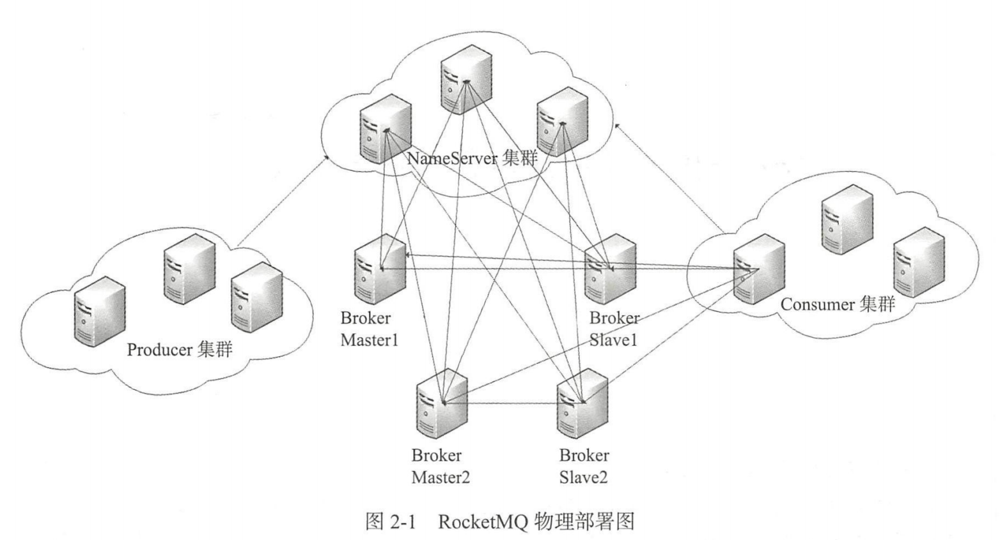
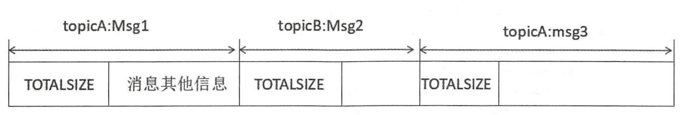
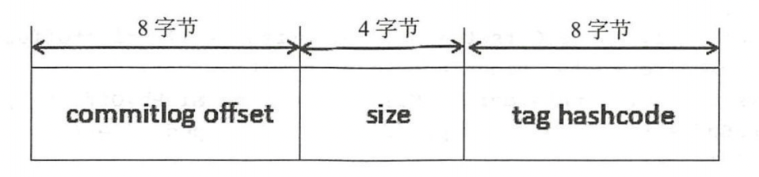

# 一、设计理念与目标

## 1. 设计理念

### 1.1 介绍

基于主题的发布与订阅模式，核心功能包括消息发送、消息存储、消息消费，整体设计追求简单与性能第一

### 1.2 特点

#### 1.2.1 简单的注册中心

从实际出发，自研NameServer来实现**元数据管理**(Topic路由信息等)，NameServer之间互不通信，复杂程度低

因为Topic路由信息无须在集群之间保持强一致性，追求**最终一致性**

##### ❓疑问：

1. 如何在集群中同步信息？

#### 1.2.2 高效的IO存储机制

追求消息发送的高吞吐量

1. 消息存储文件设计成文件组的概念，组内**单个文件大小固定**，方便引入内存映射机制
2. 消息存储基于**顺序写**，具有较高的消息写性能
3. 为了**兼顾消息消费与查找**，引入了消息消费队列文件和索引文件

#### 1.2.3 容忍设计缺陷

为了实现消息发送高可用的简单与高效，针对消息中间件中的一个难题：“**如何保证消息一定能被消息消费者消费，并且只被消费一次**”，只保证消息一定能被消费者消费，但可能会被重复消费，让使用者实现消息消费的幂等性

## 2. 设计目标

需要解决以下问题：

1. 架构模式：**发布订阅模式**，参与的组件主要包括：消息发送者、消息消费、消息服务器、路由发现
2. 顺序消息：可以保证严格有序
3. 消息过滤：服务端通过broker进行过滤，消费端需要消费者自定义过滤规则
4. 消息存储(核心)：从**消息堆积能力**和**存储性能**考量
   1. 性能：引入**内存映射机制**，所有主题的消息顺序存储在同一个文件中
   2. 堆积能力：引入**消息文件过期机制**和**文件存储空间报警机制**
5. 消息高可用性
6. 消息到达(消费)低延迟：在不发生消息堆积时，以**长轮询模式**实现准实时的消息推送模式
7. 确保消息至少被消费一次：消息确认机制ACK
8. 回溯消息(已经消费成功的消息)：支持按时间回溯
9. 消息堆积：使用**磁盘文件**进行存储，同时提供**过期机制**
10. 定时消息：支持特定延迟级别
11. 消息重试机制：消息发送异常时，会将消息重新投递

# 二、路由中心NameServer

## 1. 架构设计

为了解决消息服务器集群的高可用，让生产者在不重启服务的情况下感知消息服务器集群中的各服务器状态



1. Broker消息服务器在启动时向所有NameServer注册
2. NameServer与每台Broker服务器保持长连接，并间隔30s检测Broker是否存活
3. 如果Broker宕机，则从路由注册表中移除，但是路由变化不会马上通知消息生产者
4. 消息生产者在发送消息之前会从NameServer获取Broker服务器的地址列表，并根据负载均衡算法从列表中选择一台服务器进行消息发送

## 2. 启动流程

1. 执行`NamesrvStartup.main()`方法

2. 创建`NamesrvController`实例，**解析配置文件**，填充`NamesrvConfig`、`NettyServerConfig`属性值

3. 初始化`NamesrvController`实例，创建NettyServer网络处理对象，然后**开启两个定时任务**(心跳检测)：

   1. NameServer每隔10s扫描一次本地`brokerLiveTable`，移除处于未激活状态的Broker
      * 执行`routeInfoManager.scanNotActiveBroker()`
      * 比较`(BrokerLiveInfo.getLastUpdateTimestamp()+BROKER_CHANNEL_EXPIRED_TIME\*120s*\)`和` System.currentTimeMillis()`
   2. NameServer每隔10分钟打印一次KV配置

4. **注册JVM钩子函数**，先将线程池关闭，及时释放资源

   ~~~java
   Runtime.getRuntime().addShutdownHook(new ShutdownHookThread(log, new Callable<Void>() {
     @Override
     public Void call() throws Exception {
       controller.shutdown();
       return null;
     }
   }));
   ~~~

5. 启动NamesrvController

## 3. NameServer路由注册、故障剔除

### 3.1 路由元信息

~~~java
private final HashMap<String/* topic */, List<QueueData>> topicQueueTable;
private final HashMap<String/* brokerName */, BrokerData> brokerAddrTable;
private final HashMap<String/* clusterName */, Set<String/* brokerName */>> clusterAddrTable;
private final HashMap<String/* brokerAddr */, BrokerLiveInfo> brokerLiveTable;
private final HashMap<String/* brokerAddr */, List<String>/* Filter Server */> filterServerTable;
~~~

1. `topicQueueTable`：存储Topic消息队列路由信息
2. `brokerAddrTable`：存储brokerName、所属集群名称、主备Broker地址
3. `clusterAddrTable`：Broker集群信息，存储集群中所有的brokerName
4. `brokerLiveTable`：存储Broker状态信息。NameServer每次收到心跳包时会替换该信息
5. `filterServerTable`：存储Broker上的FilterServer列表

### 3.2 路由注册

1. **Broker发送心跳包**，BrokerStartup启动时创建并实例化BrokerController，开启定时任务，向集群中**所有的NameServer**发送心跳语句（默认30s执行一次）：

   ~~~java
   this.scheduledExecutorService.scheduleAtFixedRate(new Runnable() {
               @Override
               public void run() {
                   try {
                       BrokerController.this.registerBrokerAll(true, false, brokerConfig.isForceRegister());
                   } catch (Throwable e) {
                       log.error("registerBrokerAll Exception", e);
                   }
               }
           }, 1000 * 10, Math.max(10000, Math.min(brokerConfig.getRegisterNameServerPeriod(), 60000)), TimeUnit.MILLISECONDS);
   ->
   // BrokerOuterAPI.registerBrokerAll()
   final CountDownLatch countDownLatch = new CountDownLatch(nameServerAddressList.size());
   	for (final String namesrvAddr : nameServerAddressList) {
                   brokerOuterExecutor.execute(new Runnable() {
                       @Override
                       public void run() {
                           try {
                               RegisterBrokerResult result = registerBroker(namesrvAddr,oneway, timeoutMills,requestHeader,body);
                               if (result != null) {
                                   registerBrokerResultList.add(result);
                               }
   
                               log.info("register broker to name server {} OK", namesrvAddr);
                           } catch (Exception e) {
                               log.warn("registerBroker Exception, {}", namesrvAddr, e);
                           } finally {
                               countDownLatch.countDown();
                           }
                       }
                   });
     	}
   
   try {
     countDownLatch.await(timeoutMills, TimeUnit.MILLISECONDS);
   } catch (InterruptedException e) {
   }
   ~~~

2. **NameServer处理心跳包**，执行RouteInfoManager.registerBroker()

   1. 路由注册加写锁，依次创建或者更新`clusterAddrTable、brokerAddrTable、topicQueueTable、brokerLiveTable、filterServerTable`这5个路由表

#### 💡亮点

1. Broker在向NameServer发送心跳包时，使用`CountDownLatch`，等所有的NameServer都收到心跳包后，在执行主线程代码，取响应列表`registerBrokerResultList`中的第一个作为Broker集群主节点
2. 在更新路由表时，使用`ReentrantReadWriteLock.writeLock()`，允许并发读，减少锁的粒度，保证消息发送时的高并发

### 3.3 路由删除

1. NameServer每隔10s执行一次`RouteInfoManager.scanNotActiveBroker()`
2. 如果`lastUpdateTimestamp`超过120s，则认为该Broker不可用，需要将其从路由表中剔除
3. 执行`RouteInfoManager.onChannelDestroy()`
   1. 上`readLock().lockInterruptibly()`，从`brokerLiveTable`中获取需要剔除的Broker名称，然后解锁
   2. 上`writeLock().lockInterruptibly()`，将其从5张路由表中剔除，然后解锁

💡有两种情况会触发路由删除：

1. NameServer**定时扫描**`brokerLiveTable`，检测与上次更新的时间差，超过120s则需要移除相关的Broker信息
2. Broker**正常关闭**时，会执行unregisterBroker()

### 3.4 路由发现

RocketMQ的路由发现是非实时的，当Topic路由发生变化后，NameServer不主动推送给客户端，而是由客户端定时拉取Topic最新路由

1. 调用`DefaultRequestProcessor.getRouteInfoByTopic()`
   1. 调用`RouteInfoManager.pickupTopicRouteData()`方法从`brokerAddrTable、topicQueueTable、filterServerTable`中获取`TopicRouteData`，获取时上读锁
2. 返回Topic信息给客户端

#### ❓疑问

1. 当Topic路由发生变化后，为什么NameServer不主动推送给客户端？

   猜测：因为NameServer集群之间互不通信，可能在某一时刻出现信息不同步的问题，如果这时主动推送给客户端会造成数据不一致的情况

# 三、消息发送

## 1. 概要

RocketMQ支持3种消息发送方式：同步(sync)、异步(async)、单向(oneway)

RocketMQ消息发送需要考虑以下几个问题：

1. 消息队列如何负载？
2. 消息发送如何实现高可用？
3. 批量消息发送如何实现一致性？

## 2. 消息数据结构

## 3. 生产者启动流程

调用`DefaultMQProducer.start()`

启动时，会开启定时任务`MQClientInstance.startScheduledTask()`，其中有一个定时任务默认每隔30s向Broker（通过本地的`brokerAddrTable`获取Broker地址）发送一次心跳

## 4. 消息发送基本流程

消息发送流程的主要步骤有：验证消息、查找和选择路由、消息发送

```java
// sync
public SendResult send(Message msg, long timeout)

// async
public void send(Message msg, MessageQueueSelector selector, Object arg, SendCallback sendCallback)
  
// oneway
public void sendOneway(Message msg, MessageQueue mq)
```

### 4.1 消息验证

验证topic名称是否符合规范、长度不能超过255字节，消息体不能为空、长度大于0且小于默认的4M字节

~~~java
public static void checkMessage(Message msg, DefaultMQProducer defaultMQProducer)
        throws MQClientException {
        if (null == msg) {
            throw new MQClientException(ResponseCode.MESSAGE_ILLEGAL, "the message is null");
        }
        // topic
        Validators.checkTopic(msg.getTopic());

        // body
        if (null == msg.getBody()) {
            throw new MQClientException(ResponseCode.MESSAGE_ILLEGAL, "the message body is null");
        }

        if (0 == msg.getBody().length) {
            throw new MQClientException(ResponseCode.MESSAGE_ILLEGAL, "the message body length is zero");
        }

        if (msg.getBody().length > defaultMQProducer.getMaxMessageSize()) {
            throw new MQClientException(ResponseCode.MESSAGE_ILLEGAL,
                "the message body size over max value, MAX: " + defaultMQProducer.getMaxMessageSize());
        }
}
~~~

### 4.2 查找主题路由

调用`DefaultMQProducerImpl.tryToFindTopicPublishInfo()`

1. 如果生产者本地`topicPublishInfoTable`缓存了topic的路由信息，则直接获取
2. 如果本地没有缓存，则调用`MQClientInstance.updateTopicRouteInfoFromNameServer()`请求NameServer获取topic信息，并缓存到本地
   1. 获取到topic信息后，会对比本地路由表后判断是否更新过
   2. 如果更新过，则更新本地路由表
   3. 然后调用`MQClientInstance.topicRouteData2TopicPublishInfo()`将topic路由信息转换为`publishInfo`和`subscribeInfo`
3. 如果最终未找到相关的路由信息，则抛出`MQClientException`异常：`No route info of this topic`

### 4.3 选择消息队列

最终调用`MQFaultStrategy.selectOneMessageQueue()`

消息发送端采用重试机制，`retryTimesWhenSendFailed`指定同步方式重试次数，`retryTimes WhenSendAsyncFailed`指定异步方式重试次数，然后循环执行：选择消息队列、发送消息

选择消息队列有两种方式：

1. `sendLatencyFaultEnable=false`，默认不启用Broker故障延迟机制，直接选择上次的Broker进行发送
2. `sendLatencyFaultEnable=true`，启用Broker故障延迟机制
   1. 获取一个序号`ThreadLocalIndex`(第一次会随机获取一个，后续每执行一次会自增)，并对`MessageQueueList`大小取模，得到的数字作为`TopicPublishInfo`中的`MessageQueueList`下标来选择一个队列
   2. 如果获取的消息队列是可用的(当前时间>=该队列所属的Broker不可用时间)，则返回该队列并进行投递
   3. 如果获取的消息队列不可用，则从`FaultItem`中**按延迟从低到高**获取一个`notBestBroker`，并从其中选择一个队列返回，并进行投递

### 4.4 消息发送

1. 从本地`brokerAddrTable`获取要投递的消息队列对应的Broker地址：`mQClientFactory.findBrokerAddressInPublish()`；如果本地没有，则从NamerServer拉取

2. 分配消息全局唯一ID，如果消息体大小超过4K会进行压缩

3. 如果注册了消息发送钩子函数，则执行消息发送前的增强逻辑

4. 构建消息发送请求包，包含：生产者组、topic名称、topicKey，queueId、消息发送时间等

5. 每一次发送完后，会记录相应Broker的发送延迟到`FaultItem`中，供之后的消息队列选择

   ~~~java
   this.updateFaultItem(mq.getBrokerName(), endTimestamp - beginTimestampPrev, false);
   ~~~

6. 如果发送时发生异常，则记录到`FaultItem`中，并设置对应的Broker有10分钟不可用的状态

   ~~~java
   this.updateFaultItem(mq.getBrokerName(), endTimestamp - beginTimestampPrev, true);
   
   private long[] latencyMax = {50L, 100L, 550L, 1000L, 2000L, 3000L, 15000L};
   private long[] notAvailableDuration = {0L, 0L, 30000L, 60000L, 120000L, 180000L, 600000L};
   
   public void updateFaultItem(final String brokerName, final long currentLatency, boolean isolation) {
     if (this.sendLatencyFaultEnable) {
       // 发送成功后isolation=false，并记录对应broker的发送延迟
       long duration = computeNotAvailableDuration(isolation ? 30000 : currentLatency);
       this.latencyFaultTolerance.updateFaultItem(brokerName, currentLatency, duration);
     }
   }
   
   // 当发送时出现异常，则duration=30000ms，对应的notAvailableDuration为600*1000ms
   private long computeNotAvailableDuration(final long currentLatency) {
     for (int i = latencyMax.length - 1; i >= 0; i--) {
       if (currentLatency >= latencyMax[i])
         return this.notAvailableDuration[i];
     }
   
     return 0;
   }
   ~~~

7. 如果生产者向Broker投递消息超过最大重试次数后，会打印相关异常日志，消息投递失败

8. 如果Broker发送消息到消费者的重试次数超过最大次数后，消息将进入到死信队列，死信队列主题为:`%DLQ%+消费者组名`

9. 调用`DefaultMessageStore.putMessage()`进行消息存储

### ❓疑问

1. 当Broker宕机后，为什么生产者本地路由表中还会包含该Broker的信息呢？

   答：首先Broker默认每隔30s向NameServer发送一次心跳，NameServer默认每隔10s扫描本地路由表，并剔除超过120s还没有更新`lastUpdateTimestamp`的Broker。由于NameServer更新本地路由表后，并不会向生产者主动推送相关信息，只能通过生产者默认每隔30s向Broker发送心跳进行确认。因此生产者本地路由表会存在短暂不一致问题。

2. 当生产者的本地路由表中包含已宕机的Broker，并且恰好选择了该Broker进行消息投递时，会怎么处理？

   答：当次发送消息由于Broker宕机，未发生成功，在抛出异常后，会记录到`FaultItem`中并隔离，该Broker默认有10分钟的时间处于不可用状态。随后进行重试，重新选择一个Broker进行投递。

# 四、消息存储

## 1. 概要


## 2. 消息发送存储流程

入口：`org.apache rocketmq.store.DefaultMessageStore#putMessage`

1. **校验**：如果Broker已关闭、为Slave角色或者当前RocketMQ不支持写入、消息主题和属性长度过长，则拒绝消息写入

2. **判断是否为延迟消息**：`if(msg.getDelayTimeLevel()) > 0`。如果为延迟消息，则更新为延迟消息主题`SCHEDULE_TOPIC`和消息队列ID

3. **获取当前可以写入的Commitlog文件**

   * 注：`MappedFileQueue`可以看作是commitlog文件夹，`MappedFile`则是该文件夹下的一个个文件

   ~~~java
   MappedFile unlockMappedFile = null;
   MappedFile mappedFile = this.mappedFileQueue.getLastMappedFile();
   ~~~

4. 获取到可写入的文件后，进行加锁，然后对文件进行**校验**：

   1. 如果是第一次写入，则新建文件进行写入，偏移量为0
   2. 如果文件已经写满，则新建文件进行写入，偏移量紧挨着上一个文件之后

5. 调用`MappedFile.appendMessage()`，获取待写入文件的`currentPos`，如果`currentPos<file.size()`，则通过`slice()`**创建`ByteBuffer`**，否则意味着文件已经写满，抛出UNKOWN_ERROR

6. 调用`CommitLog.doAppend()`，**创建全局唯一的消息ID**(4字节IP+4字节端口号+8字节偏移量=16字节)

   * 可以根据msgId中的消息偏移量找到消息内容

7. 根据topic和queueId从`CommitLog`维护的`topicQueueTable`中获取对应的消息队列**偏移量**queueOffset

8. 根据消息体长、主题长度、属性长度**计算出消息总长度**

   ~~~java
   final int msgLen = calMsgLength(bodyLength, topicLength, propertiesLength);
   ~~~

9. 根据消息总长度判断文件剩余空间**是否足够写入**，如果空间不足，则返回`AppendMessageStatus.END_OF_FILE`，Broker会重新创建一个新的CommitLog文件来存储该消息

10. 如果空间足够，则将消息内容**存储到ByteBuffer中**，返回`AppendMessageStatus.PUT_OK`

   * 此时只是将消息追加在内存中，后面还需要根据同步还是异步刷盘方式，将内存中的数据持久化道磁盘中

11. **更新消息队列逻辑偏移量**，处理完后释放锁

12. 将内存中的数据**持久化**到磁盘中，然后执行**HA主从同步复制**

    ~~~java
    handleDiskFlush(result, putMessageResult, messageExtBatch);
    handleHA(result, putMessageResult, messageExtBatch);
    ~~~

## 3. 存储文件组织与内存映射

RocketMQ通过使用内存映射文件来提高IO访问性能，CommitLog、ConsumeQueue和IndexFile的单个文件大小都是固定长度，一个文件写满后再创建一个新文件，文件名为该文件中第一条消息对应的全局物理偏移量。

### 3.1 MappedFileQueue映射文件队列

`MappedFileQueue`是`MappedFile`的管理容器，`MappedFileQueue`是对存储目录的封装


## 3.2 MappedFile内存映射文件

`MappedFile`对应着存储目录下的一个个文件


### 3.3 TransientStorePool临时存储池

用于提供一种内存锁定，将当前堆外内存一直锁定在内存中，避免被进程将内存交换到磁盘，以提高性能


## 4. 存储文件

1. commitlog：消息存储目录
2. config：运行期间的一些配置信息
3. consumequeue：消息消费队列存储目录
4. index：消息索引文件存储目录
5. abort：默认启动时创建，正常退出前删除。如果存在则说明Broker非正常关闭
6. checkpoint：文件检测点，存储commitlog文件最后一次刷盘时间戳，consumequeue最后一次刷盘时间，index索引文件最后一次刷盘时间戳

### ❓疑问

1. 如何保证存储文件时的数据一致性？

### 4.1 commitlog文件

该目录下的文件主要存储消息

特点：每一条消息的长度不一定相同

commitlog文件存储的逻辑视图如下：



### 4.2 consumequeue文件

由于同一主题下的消息**不连续**地存储在commitlog文件中，根据主题进行消息检索的**效率很低**，因此设计了消息消费队列文件

consumequeue文件可以看作是commitlog文件关于消息消费的索引文件，一级目录为主题，二级目录为主题的消息队列queueId

为了加速consumequeue中消息检索速度和节省磁盘空间，每一个ConsumeQueue条目不会存储消息的全量信息，其存储格式如下：



### 4.3 Index索引文件

为消息建立索引，方便根据消息key进行消息查询

### 4.4 checkpoint文件

用于记录commit log、comsumequeue、index文件的刷盘时间点

# 五、消息消费

需要解决以下问题：

- [ ] 消息队列负载与重新分布
- [ ] 消息消费模式
- [ ] 消息拉取方式
- [ ] 消息进度反馈
- [ ] 消息过滤
- [ ] 顺序消息

## 1. 概述

1. 消费模式：
   1. 集群消费：同一个消费组下，主题下的一条消息只能被一个消费者消费
      * 消息进度保存在消费端
   2. 广播消费：同一个消费组下，主题下的一条消费可以被所有消费者消费
      * 消息进度保存在Broker上
2. 消息服务器和消费者之间的消息传送有两种方式：推模式Push、拉模式Pull
   * RocketMQ消息推模式的实现基于拉模式，在拉模式上包装一层
3. 集群模式下，消息队列负载机制：一个消息队列同一时间只能被一个消费者消费，一个消费者可以消费多个消息队列
4. RocketMQ支持局部消息消费：即保证同一个消息队列上的消息顺序消费。如果要实现某一个主题的全局顺序消息消费，需要将该主题的队列数设置为1，牺牲高可用性。
5. RocketMQ支持两种过滤模式：表达式(TAG、SQL92)与类过滤模式

## 2. 消费者启动流程

​    

## 3. 消息拉取

