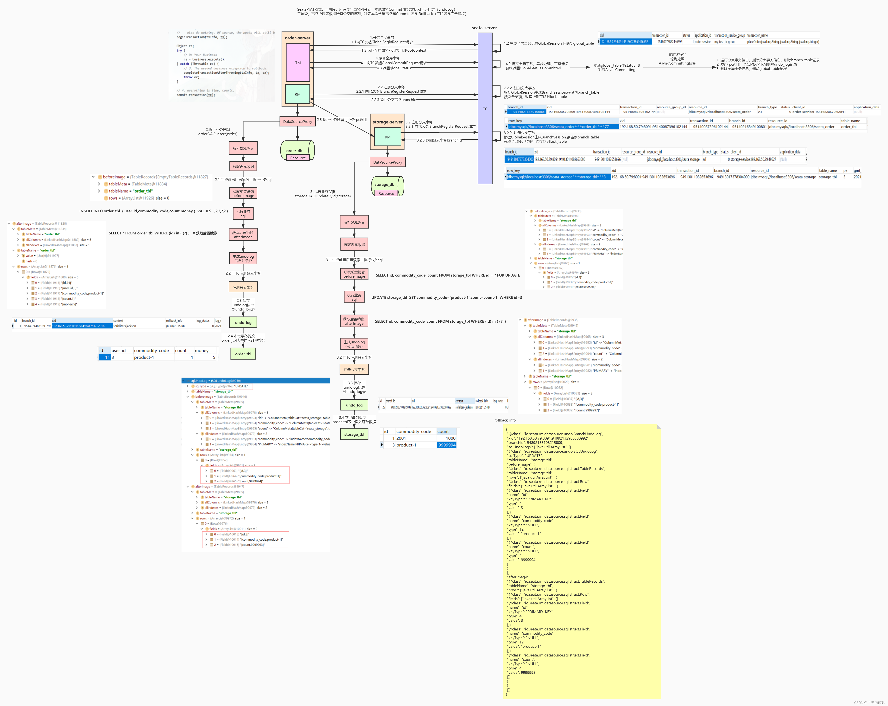
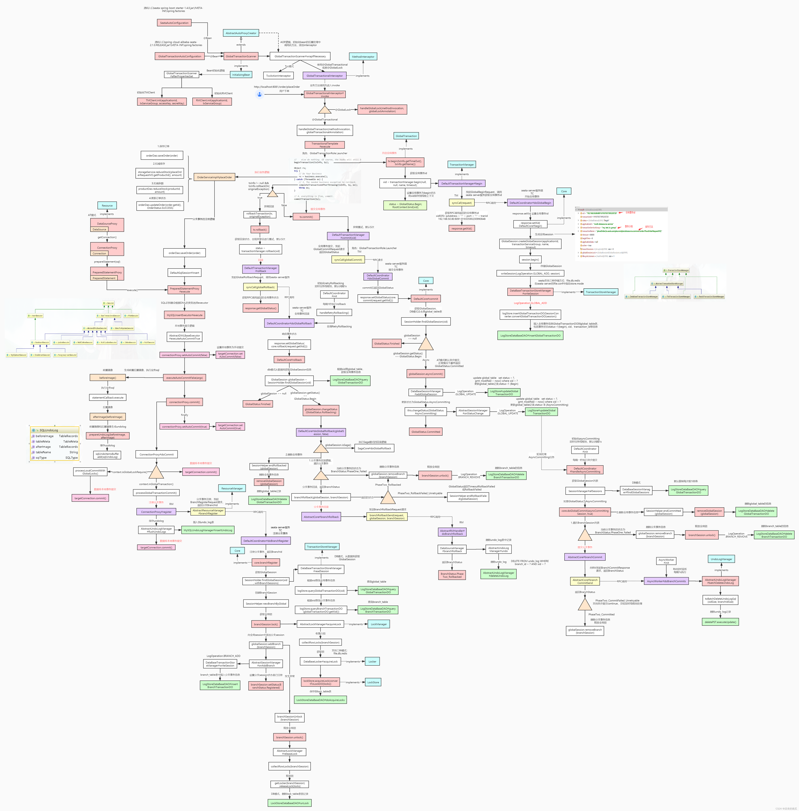

seata工作原理流程图

seata源码流程图

疑问：AT和TCC是如何实现2PC的？

以AT模式为例，Seata的二阶段提交流程

# 详细流程

## 1. 事务开启前

1. 通过SeataAutoConfiguration将GlobalTransactionScanner注入到Spring Bean容器中
2. 在GlobalTransactionScanner.wrapIfNeccessary()中添加GlobalTransactionInterceptor

3. GlobalTransactionInterceptor拦截带有@GlobalTransactional的类或者方法，调用invoke()进行处理
4. invoke()最终调用TransactionalTemplate.execute()，这是一个事务模板方法

~~~java
try {
  // 2. begin transaction
  beginTransaction(txInfo, tx);

  Object rs = null;
  try {

    // Do Your Business
    rs = business.execute();

  } catch (Throwable ex) {

    // 3.the needed business exception to rollback.
    completeTransactionAfterThrowing(txInfo, tx, ex);
    throw ex;
  }

  // 4. everything is fine, commit.
  commitTransaction(tx);

  return rs;
} finally {
  //5. clear
  triggerAfterCompletion();
  cleanUp();
}
~~~

## 2. 开启全局事务

1. TransactionalTemplate.beginTransaction()中调用DefaultGlobalTransaction.begin()，然后调用DefaultTransactionManager.begin()，通过GlobalBeginRequest.syncCall()**向TC发起开启事务请求**

2. 通过rpc方式通知TC的GlobalBeginRequest.handle()接收，并调用DefaultCoordinator.doGlobalBegin() -> DefaultCore.begin()

   1. 调用GlobalSession.createGlobalSession()生成全局session，**全局事务xid**在此时生成

   2. 添加SessionLifeCycleListener

   3. 调用GlobalSession.begin() -> SessionLifecycleListener.onBegin() -> AbstractSessionManager.addGlobalSession() -> DataBaseTransactionStoreManager.writeSession()，

      最终调用LogStoreDataBaseDAO.insertGlobalTransactionDO()**将事务信息写入到global_table表**

   4. 全局事务入库完成后，返回到DefaultGlobalTransaction.begin()，**将GlobalStatus设置为Begin**，并**将xid绑定到RootContext中**

## 3. 执行本地事务

### 1. 执行SQL语句

1. 通过seata代理数据源DataSourceProxy，在进行数据库操作时，调用PrepareStatement的代理类PrepareStatementProxy.execute() -> ExecuteTemplate.execute()，通过SQLRecognizer识别DML操作选择对应的Executor
2. 每个Executor都会执行AbstractDMLBaseExecutor.doExecute() -> executeAutoCommitTrue()
3. 设置autoCommit为false，然后会调用AbstractDMLBaseExecutor.executeAutoCommitFalse()在sql执行前后生成镜像，调用prepareUndoLog
   1. 根据执行的SQL构造lockKey存储在Set中
   2. 将前后置镜像存储到List里面
4. 执行ConnectionProxy.commit() -> doCommit() -> processGlobalTransactionCommit()

~~~java
private void processGlobalTransactionCommit() throws SQLException {
        try {
            register();
        } catch (TransactionException e) {
            recognizeLockKeyConflictException(e, context.buildLockKeys());
        }
        try {
            UndoLogManagerFactory.getUndoLogManager(this.getDbType()).flushUndoLogs(this);
            targetConnection.commit();
        } catch (Throwable ex) {
            LOGGER.error("process connectionProxy commit error: {}", ex.getMessage(), ex);
            report(false);
            throw new SQLException(ex);
        }
        if (IS_REPORT_SUCCESS_ENABLE) {
            report(true);
        }
        context.reset();
    }
~~~

### 2. 注册分支

1. 调用ConnectionProxy.register() -> DefaultResourceManager.branchRegister() -> AbstractResourceManager.branchRegister()注册分支

2. TC通过RmBranchCommitProcessor.process()接受来自RM的分支注册请求，调用DefaultCoordinator.onRequest() -> BranchRegisterRequest.handle() -> AbstractTCInboundHandler.handle() -> DefaultCoordinator.doBranchRegister() -> AbstractCore.branchRegister()

3. 调用SessionHelper.newBranchByGlobal()生成分支信息

4. 调用ATCore.branchSessionLock() -> BranchSession.lock() -> BranchSession.lock() -> DataBaseLocker.acquireLock() ->  LockStoreDataBaseDAO.acquireLock()获取全局锁

   1. 调用AbstractLockManager.acquireLock() -> collectRowLocks()收集行锁

      * 锁在BaseTransactionalExecutor.buildLockKey()中构造，格式为`{table_name}:{pk1_name}_{pk1_value},{pk2_name}_{pk2_value}`, 然后存储到ConnectionContext.lockKeysBuffer中，最后通过ConnectionContext.buildLockKeys()构造最终的锁结构:

        `{table1_name}:{t1_pk1_name}_{t1_pk1_value},{t1_pk2_name}_{t1_pk2_value};{table2_name}:{t2_pk1_name}_{t2_pk1_value},{t2_pk2_name}_{t2_pk2_value}`

   2. 调用AbstractLockStoreSql.getCheckLockableSql()查询lock_table中**row_key**是否有对应的数据来检查锁

   3. 如果不能获取锁，则执行回滚，不能获取锁有两种情况：

      * dbXID和currentXID不相等
      * dbExistedRowKeys中存在当前需要获取锁的事务的rowKey

   4. 如果能够获取锁，则调用LockStoreDataBaseDAO.doAcquireLock()，**在lock_table中写入一条事务信息**

5. 调用GlobalSession.addBranch() -> LifecycleListener.onAddBranch() -> DataBaseTransactionStoreManager.writeSession() -> LogStoreDataBaseDAO.insertBranchTransactionDO()**将分支事务信息写入到branch_table表**中

6. 返回到GlobalSession.addBranch()，**将BranchSession的状态设置为Registered**

7. 如果发生异常，则调用AbstractCore.branchSessionUnlock() -> ATCore.branchSessionUnlock() -> BranchSession.unlock() -> DataBaseLockManager.releaseLock() -> DataBaseLocker.releaseLock() -> LockStoreDataBaseDAO.unLock()将lock_table中对应的事务锁信息删除，释放全局锁

### 3. 提交本地事务

1. 调用AbstractUndoLogManager.flushUndoLogs()将缓存中的undoLog写入到undo_log表中

### 4. 上报分支情况

1. 调用ConnectionProxy.report() -> AbstractResourceManager.branchReport()向TC上报分支情况
   * **本地事务提交成功，BranchStatus为PhaseOne_Done**，否则为PhaseOne_Failed
2. TC通过BranchReportRequest.handle()接收上报情况
3. 调用AbstractTCInboundHandler.handle() -> DefaultCoordinator.doBranchReport() -> AbstractCore.branchReport()
4. 根据branchId获取分支信息，并调用GlobalSession.changeBranchStatus() -> AbstractSessionManager.updateBranchSessionStatus() -> DataBaseTransactionStoreManager.writeSession() -> LogStoreDataBaseDAO.updateBranchTransactionDO()**更新branch_table表中branch_status字段**

### 5. RPC调用其他服务

以Feign为例，需要使用spring-cloud-alibaba-seata包

1. Seata通过实现Client接口，为SeataFeignClient，在执行execute()向其他服务发起请求时，调用getModifyRequest()，将RootContext.getXID()写入请求头中
2. 其他服务接收到请求后，在SeataHandlerInterceptor中拦截请求，调用preHandle()，将请求头中的XID绑定到该服务的RootContext中，完成XID的传递

## 4. 全局事务提交

1. 调用TransactionTemplate.commitTransaction() -> DefaultTransactionManager.commit()向TC发送提交请求

2. TC通过GlobalCommitRequest.handle()接收提交请求

3. 调用AbstractTCInboundHandler.handle()将响应体中的GlobalStatus设置为Committing返回给TM

4. 调用DefaultCoordinator.doGlobalCommit() -> DefaultCore.commit()

   1. 通过xid调用SessionHolder.findGlobalSession()获取全局事务

   2. 如果GlobalSession为空，则将**GlobalStatus更新为Finished**

   3. 调用SessionHolder.lockAndExecute()，关闭GlobalSession，同时释放全局锁

   4. 如果GlobalStatus为Begin，则**更新GlobalStatus为Committing**，此时允许执行提交操作；

      也就是只有第一个分支提交时允许执行提交操作，后面分支提交时GlobalStatus为Committing，不会执行提交操作

      ~~~java
      boolean shouldCommit = SessionHolder.lockAndExecute(globalSession, () -> {
        // the lock should release after branch commit
        // Highlight: Firstly, close the session, then no more branch can be registered.
        globalSession.closeAndClean();
        if (globalSession.getStatus() == GlobalStatus.Begin) {
          globalSession.changeStatus(GlobalStatus.Committing);
          return true;
        }
      return false;
      });
      ~~~

   5. 调用GlobalSession.canBeCommitedAsync()，只有AT和SAGA模式可以执行异步提交

   6. 调用GlobalSession.asyncCommit()，将**GlobalStatus更新为AsyncCommitting**

5. DefaultCoordinator中的asyncCommitting线程池默认每隔一秒执行一次handleAsyncCommitting()

   * Server（TC）在启动时会执行DefaultCoordinator.init()来初始化一些异步线程池

6. DefaultCoordinator.handleAsyncCommitting()从SessionHolder中读取所有GlobalStatus为AsyncCommitting的GlobalSession，然后遍历执行DefaultCore.doGlobalCommit()

   1. 如果一阶段提交失败，则调用GlobalSession.removeBranch()删除分支信息
   2. 调用AbstractCore.branchCommit(), 通过RemotingServer.sendSyncRequest()同步向RM发送请求确认
   3. RM通过AbstractRMHandler.handle()接收TC发送的branchCommit确认请求
   4. 在AbstractRMHandler.doBranchCommit()中调用AsyncWorker.branchCommit()，向ASYNC_COMMIT_BUFFER队列中添加Phase2Context对象

7. AsyncWorker.init()会在Server启动时执行，会启动一个线程池每隔一秒执行AsyncWorker.doBranchCommits()

   1. AsyncWorker.doBranchCommits()中从ASYNC_COMMIT_BUFFER队列中获取Phase2Context对象，并筛选出AT模式的DataSourceManager
   2. 调用AbstractUndoLogManager.batchDeleteUndoLog()将本地undo_log表中对应的数据删除

8. 执行成功后在AbstractRMHandler.doBranchCommit()中向TC返回**BranchStatus.PhaseTwo_Committed**

9. 调用GlobalSession.removeBranch()删除分支信息

10. 调用SessionHelper.endCommitted()更新GlobalStatus为**Committed**，并调用GlobalSession.end() -> AbstractSessionManager.onEnd()->... ->LogStoreDataBaseDAO.deleteGlobalTransactionDO()删除global_table中对应的数据。

# 精简流程

## 1. 事务开启前

1. 自动装配
2. 添加拦截器
3. 拦截
4. 调用事务模板方法

## 2. 开启全局事务

1. TM向TC发起开启全局事务请求
2. TC生成GlobalSession以及XID
3. TC将GlobalSession信息写入到global_table中
4. TC返回XID给TM，TM将GlobalStatus设置为Begin，同时将XID绑定到RootContext

## 3. 执行本地事务

### 1. 执行SQL语句

1. 通过Seata的数据源代理执行代理类PrepareStatementProxy.execute()
2. 通过SQLRecognizer识别DML操作来选择不同的Executor
3. 在执行SQL语句前后分别生成前后置镜像
4. 根据table_name, pk_name, pk_value构造LockKey
5. 根据前后置镜像生成undo log，并缓存在List中

### 2. 注册分支

1. RM将多个LockKey用分号拼接成LockKeys，通过TM向TC发起分支注册请求，参数中带有LockKeys
2. TC根据GlobalSession生成BranchSession
3. 根据LockKeys构造的row_key查询lock_table对应的数据来判断是否能获取事务锁，如果lock_table中数据不存在则插入，即获取到锁，否则抛出异常
4. 将BranchSession信息存储到branch_table表中
5. 将BranchSession的状态设置为Registered
6. 向RM返回branchId，设置到ConnectionContext中

### 3. 提交本地事务

1. 将缓存的undoLog写入到本地undo_log表中
2. 提交本地事务

### 4. 上报分支事务

1. 在记录操作外开启循环，发生异常后重试一定次数
2. 记录本地事务执行是否成功，如果成功BranchStatus为PhaseOne_Done，否则为PhaseOne_Failed
3. RM通过TM向TC发起上报请求，TM接收后修改branch_table中status字段

### 5. XID在服务间的传递

1. 在SeataFeignClient.execute()中将XID设置到请求头中
2. 在SeataHandlerInterceptor.preHandle()中从请求头中取出XID，并绑定到RootContext

## 4. 全局事务提交

1. 在提交操作外开启循环，发生异常后重试一定次数
2. TM向TC发起事务提交请求
3. TM收到请求后，释放全局锁并关闭GlobalSession
4. 将全局事务状态设置为Committing
5. 全局事务状态设置成功后，更新global_table中global_status为AsyncCommitting
6. 响应TM全局事务状态
7. 通过TC启动时开启的asyncCommitting线程池每隔1秒遍历GlobalStatus为AsyncCommitting的GlobalSession
8. 遍历GlobalSession的BranchSession，对一阶段提交成功的分支发起全局提交确认请求
9. RM接收到请求后，创建Phase2Context对象并放入阻塞队列
10. 成功后，RM将BranchStatus更新为PhaseTwo_Committed，并响应TC
    1. AsyncWorker在初始化时启动定时任务线程池，每隔1秒执行二阶段提交确认操作
    2. 删除本地undo_log表中对应的分支事务数据
11. TC接收到BranchStatus，如果是PhaseTwo_Committed，则删除branch_table中对应的分支数据
12. 更新global_table中status字段为Committed
13. 最后删除global_table中对应事务的数据

# 疑问

1. 执行本地事务SQL语句前后生成的前置镜像beforeImage和后置镜像afterImage的作用是什么？
     1. beforeImage根据从SQL解析出来的表信息，使用select for update查询数据库信息
     2. 在执行SQL完成后，afterImage根据beforeImage中的主键查询执行后的数据进行构造
     3. 对于update和delete操作，在执行回滚的时候会根据beforeImage构造undoSQL回滚到事务前的状态
     4. 对于insert操作，由于在insert前并不存在对应的数据，因此需要根据afterImage来构造undoSQL删除insert的数据