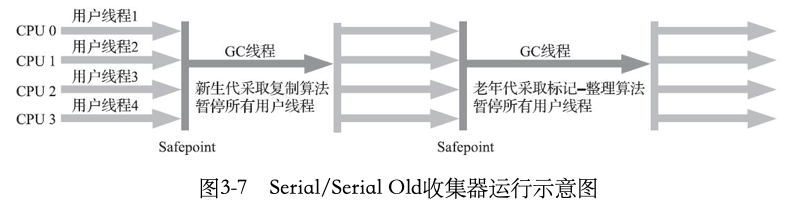
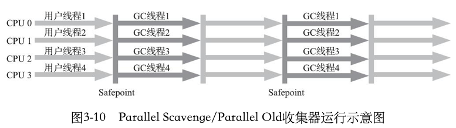

# 第一章

#### 概念

JRE：是支持Java程序运行的标准环境，由Java类库API中的JavaSE API子集和Java虚拟机两部分组成。

# 第二章 自动内存管理

## 一、运行时数据区

### 1. 程序计数器

​        程序计数器可以看作是当前线程所执行的字节码的**行号指示器**，是程序控制流的指示器。

​		作用：为了线程切换后能恢复到正确的执行位置，每条线程都需要有一个独立的程序计数器；分支、循环、跳转、异常处理、线程恢复等基础功能需要依赖计数器完成。

​        线程正在执行的是一个**Java方法**，这个计数器**记录的是正在执行的虚拟机字节码指令的地址**；如果正在执行的是**本地（Native）方法**，这个计数器**值则应为空（Undefined）**。

⚠️注意：程序计数器是**唯一**一个在《Java虚拟机规范》中**没有规定任何OutOfMemoryError情况**的区域。

### 2. Java虚拟机栈

​        Java虚拟机栈描述的是Java方法执行的线程内存模型。

​		作用：用于存储局部变量表、操作数栈、动态链接、方法出口等信息。

​		模型：每一个方法从被调用到执行完毕的过程，对应着一个栈帧在虚拟机栈中入栈和出栈的过程。	

在《Java虚拟机规范》中，对这个内存区域规定了两类异常状况：

* **StackOverflowError**：当线程请求的栈的深度大于虚拟机所允许的深度时
* **OutOfMemoryError**：如果Java虚拟机栈容量可以动态扩展，当栈扩展时无法申请到足够的内存时
  * ⚠️ HotSpot虚拟机的栈容量是不可以动态扩展的，所以HotSpot虚拟机不会因为虚拟机栈无法扩展而导致该异常，只要申请成功就不会有OOM，但是申请失败仍会抛出OOM异常。

### 3. 本地方法栈

​		本地方法栈和虚拟机栈作用相似

本地方法栈和虚拟机栈的区别：

* 本地方法栈为虚拟机使用**本地(Native)方法**服务

* 虚拟机栈为虚拟机执行**Java方法(字节码)**服务

### 4. Java堆

​		Java堆是一块用来**存储类实例和数组**的运行时内存区域，被所有**线程共享**，在虚拟机启动时创建。

​		作用：用来存放对象实例。

​		Java堆中可以划分出多个**线程私有的分配缓冲区**(Thread Local Allocation Buffer， TLAB)，可以提升对象分配时的效率。

存在的异常：

* 如果在Java堆中没有足够内存完成实例分配，并且堆也无法再扩展时，就会抛出OOM异常。

##### 疑问❓

1. 什么是TLAB，它的作用是什么，原理是什么？

### 5. 方法区

​		方法区与Java堆一样是各个线程共享的内存区域

​		作用：用于存储已被虚拟机加载的**类型信息**、**常量**、**静态变量**、即时编译器编译后的**代码缓存**等数据。

⚠️ 方法区的实现主要有**永久代**(JDK8以前)和**元空间**(JDK8及以后)

* 由于永久代有容量上限，因此容易遇到内存溢出的问题，自从JDK8之后使用本地内存的元空间代替。

#### 5.1 运行时常量池

​		运行时常量池是方法区的一部分。

​		作用：用于存放编译期生成的各种**字面量**和**符号引用**。

​		特性：运行时常量池具备动态性，这是相对于Class文件常量池的一个重要特征。运行期间可以将新的常量放入池中。

方法区存在的异常：如果无法申请到足够的内存时会抛出OOM异常。

### 6. 直接内存（非运行时数据区）

​		在JDK1.4中的NIO(New Input/Output)类中，引入了一种基于通道(Channel)和缓冲区(Buffer)的I/O方式，它可以使用Native函数库直接分配堆外内存，通过这种方式分配的内存成为直接内存。

​		作用：这种内存分配方式因为避免了在Java堆和Native堆中来回复制数据，可以在一些场景中显著提高性能。

​		⚠️注意：虽然直接内存的分配不受Java堆大小的限制，但是会受到本机总内存大小以及处理器寻址空间的限制。当各个内存区域总和大于物理内存限制会导致动态扩展时出现OOM异常。

## 二、HotSpot虚拟机对象探秘

针对普通Java对象

### 1.对象的创建

以new指令为例

#### 1. 检查

首先将去**检查**这个指令的参数是否能在**常量池**中定位到一个类的**符号引用**，并且检查这个符号引用代表的类是否已被加载、解析和初始化过。如果没有，那必须先执行相应的类加载过程；

#### 2. 分配内存

在类加载检查通过后，接下来虚拟机将为新生对象**分配内存**。对象所需内存的大小在类加载完成后便可完全确定；

1. 分配方式

   * 如果Java堆中的内存是**规整**的，那么使用**指针碰撞（Bump The Point）**方式分配内存

   * 如果Java堆中的内存**不规整**，那么使用**空闲列表（Free List**）方式分配内存
     * 空闲列表记录着哪些内存块是可用的
   

⚠️ Java堆是否规整由虚拟机所采用的垃圾收集器是否带有**空间压缩整理**能力决定的

* Serial、ParNew等带有**压缩整理**过程的收集器，分配算法是指针碰撞，简单高效
* CMS基于**清除算法**的收集器，采用的是空闲列表来分配内存

2. 分配时存在并发安全问题解决方案

   堆内分配内存时需要修改指针所指向的位置，可能会出现多个对象使用同一个指针来分配内存。

   1. 对分配动作同步处理：采用CAS + 失败重试直到成功
      * 能保证指针更新操作的原子性
      
   2. 按线程划分在不同空间上处理：**本地线程分配缓冲区**(Thread Local Allocation Buffer, TLAB)
      * 处理方式：每个线程在Java堆中预先分配一小块内存，当缓冲区用完后，需要同步锁定分配新的缓冲区。
      
      * 使用方式：-XX:+/-UseTLAB
      
      * ⚠️ 使用TLAB后，虚拟机将分配的内存空间初始化为零值的操作可以提前到TLAB分配时进行
      
      * TLAB的对象分配方式：
      
        1. 快分配：当TLAB内存充足时，分配新对象的方式称为快分配
        2. 慢分配：当TLAB内存不充足时，分配新对象的方式称为慢分配，有两种处理方式
           1. 当TLAB剩余空间小于TLAB最大浪费空间时，丢弃当前TLAB回归Eden，线程获取新的TLAB来分配对象
           2. 当TLAB剩余空间大于TLAB最大浪费空间时，对象直接在Eden区分配内存
      
        * **TLAB最大浪费空间**：最大浪费空间是一个动态值，
      
          `TLAB最大浪费空间初始值＝TLAB大小／TLABRefillWasteFraction`。`TLABRefillWasteFraction`默认为64，所以TLAB最大浪费空间初始值为TLAB大小的1/64。伴随着每次慢分配，这个TLAB最大浪费空间会每次递增` TLABWasteIncrement` 大小的空间。
          原文链接：https://blog.csdn.net/a1076067274/article/details/112969208

   ##### 疑问❓

3. 空闲列表的数据结构是什么样的？

2. 空闲列表在分配内存中是如何运行的？

#### 3. 设置对象头

虚拟机会将对象的从属、元数据、哈希码、GC分代年龄等信息存放在对象头中

#### 4. 构造对象

* 从虚拟机的视角来看，经过上面3个步骤，一个新的对象已经产生了。
* 从Java程序的视角来看，对象的创建才刚刚开始，变量还都是默认的零值。

此时需要执行对象的**构造函数**(Class文件中的<init>()方法)，执行完毕后，一个真正可用的对象才算完全被构造出来。

💡clinit方法是类加载的**初始化**时执行的，init方法时对象**实例化**时执行的

##### 疑问❓

1. Class文件中的init方法是什么，是如何运行的？

### 2. 对象的内存布局

在HotSpot虚拟机中，对象在堆内存中的存储布局可以分为三个部分：**对象头(Header)**、**实例数据(Instance Data)**、**对齐填充(Padding)**。

#### 1. 对象头

HotSpot虚拟机对象的对象头包括两类信息：

1. 存储**对象自身的运行时数据**，如哈希码（HashCode）、GC分代年龄、锁状态标志、线程持有的锁、偏向线程ID、偏向时间戳等
2. 存储**类型指针**，即对象指向他的类型元数据的指针，Java虚拟机通过这个指针来**确定该对象是哪个类的实例**

#### 2. 实例数据

​		实例数据是对象真正存储的有效信息，即代码里面所定义的各种类型的字段内容，包括从父类继承下来的。

##### 存储顺序

由虚拟机分配策略参数（-XX:FieldsAllocationStyle参数）和字段在Java源码中定义顺序所决定。

HotSpot虚拟机默认的分配顺序是：

1. longs/doubles、ints、shorts/chars、bytes/booleans、oops（OrdinaryObjectPointers，OOPs）
2. 在1中前提下，父类定义的变量会在子类前面

💡**Tip:** 如果HotSpot虚拟机的+XX:CompactFields参数值为true（默认就为true），那**子类之中较窄的变量也允许插入父类变量的空隙之中**，以节省出一点点空间。

#### 3. 对齐填充

用来补齐对象实例数据不满8字节倍数的部分。

HotSpot虚拟机的自动内存管理系统要求**对象起始位置**必须是8字节的整数倍，也就是**任何对象的大小都必须是8字节的整数倍**。

### 3. 对象的访问定位

​		《Java虚拟机规范》规定了**reference类型是一个指向对象的引用**，Java程序**通过栈上的reference数据来操作堆上的具体对象**。

对象访问方式主要有两种：

1. **句柄访问**：Java堆中会划分出一块内存作为句柄池，reference中存储的就是对象的句柄地址，而**句柄中包含了对象实例数据与类型数据的具体地址信息**。
2. **直接指针访问**：reference中存储的是对象地址

比较：

|              | 优势                                              | 劣势 |
| :----------- | :------------------------------------------------ | ---- |
| 句柄访问     | 存储稳定，对象移动时(如垃圾收集)无需修改reference |      |
| 直接指针访问 | 只访问对象本身节省一次间接访问的开销              |      |

# 第三章 垃圾收集器与内存分配策略

在Java内存运行时区域中，**程序计数器**、**虚拟机栈**、**本地方法栈**3个区域都与线程的生命周期一致，其内存分配和回收都具有确定性，当方法或者线程结束时，内存就跟随着回收了。

**Java堆**和**方法区**2个区域有着很显著的不确定性，只有处于运行期间，才知道程序究竟创建哪些对象以及多少个对象，这部分内存的分配和回收是动态的。

## 一、对象已死？

## 二、垃圾收集算法

从如何判定对象消亡的角度，垃圾收集算法可以分为“**引用计数式**”和“**追踪式**”垃圾收集

### 1. 分代收集理论

* 弱分代假说：绝大多数对象都是朝生夕灭
* 强分代假说：熬过垃圾收集次数越多的对象就越难以消亡
* 跨代引用假说：跨代引用相对于同代引用来说仅占极少数
  * 对象不是孤立的，对象之间存在跨代引用
  * 存在相互引用关系的对象，倾向于同时生存或者同时消亡

基于这两个分代假说，为不同消亡特征的对象划分出不同的区域，对应不同的垃圾收集算法：

* 标记-清除
* 标记-复制
* 标记-整理

垃圾收集名词：

* 部分收集：
  1. 新生代收集（Minor GC/Young GC）
  2. 老年代收集（Major GC/Old GC）
  3. 混合收集（Mixed GC）
* 整堆收集（Full GC）

### 2. 标记-清除算法

#### 1. 算法逻辑

分为标记和清除两个阶段：

1. 标记：标记所有需要回收的对象，标记过程就是判定对象是否属于垃圾的过程
2. 清除：统一回收掉被标记的对象

#### 2. 优劣势

* 优势：过程简单，效率高

* 劣势：
  1. 执行效率不稳定：大量需要回收的对象都需要进行标记操作
  2. 内存空间**碎片化**：清除操作会产生大量不连续的内存空间，如果分配大对象，可能因为没有足够大的连续内存而提前触发垃圾收集

### 3. 标记-复制算法

#### 1. 算法逻辑

1. 划分出两块内存区域
2. 标记所有需要回收的对象
3. 统一回收掉被标记的对象
4. 分配内存时
   1. 如果内存足够，移动堆顶指针顺序分配
   2. 如果内存不足，将存活的对象复制到另一块内存上

#### 2. 优劣势

* 优势：不用考虑空间碎片的情况
* 劣势：
  1. 会浪费一定的内存空间
  2. 当对象存活率较高时，就会进行频繁的复制操作，效率会降低

#### 3. 实现方案

Appel式回收

* 通常用于新生代的内存布局，使用的收集器有Serial、ParNew等
* 实现：将新生代分为一块较大的Eden空间和两块较小的Survivor空间(toSurvivor和fromSurvivor)，每次分配内存只使用Eden和一块Survivor。当发生垃圾收集时，将Eden和Survivor中存活的对象一次性复制到另一块Survivor上，然后直接清理掉之前的内存空间。当Survivor空间不足以容纳一次MinorGC后存活的对象时，存活的对象将通过**分配担保**机制进入老年代

### 4. 标记-整理算法

#### 1. 算法逻辑

1. 标记所有需要回收的对象
2. 将未被标记的存活对象移动到内存空间的空闲一端，并更新移动对象的引用
3. 清理掉存活对象边界以外的内存

#### 2. 优劣势

* 优势：标记-整理属于**移动式**的回收算法，由于**创建和访问对象比垃圾收集更频繁**，所以移动式回收算法在整体**吞吐量**上更优
  * 💡移动对象在内存回收时更复杂，不移动则对象在分配内存和访问时更复杂
* 劣势：使用移动式回收算法，垃圾收集的停顿时间更长，而且必须全程暂停用户应用程序，会出现**Stop The World**情况

### 5. 总结

依据分代收集理论，为具有不同消亡特征的对象划分出不同的内存空间，并使用不同的垃圾收集算法

| 垃圾收集算法 | 分代   | 收集器                           | 特点             |
| ------------ | ------ | -------------------------------- | ---------------- |
| 标记-清除    | 老年代 | CMS                              | 非移动式，延迟低 |
| 标记-复制    | 新生代 | Serial, ParNew                   | 避免内存碎片化   |
| 标记-整理    | 老年代 | Parallel Scavenge, CMS(兜底策略) | 移动式，吞吐量高 |

💡CMS收集器是基于标记-清除算法，如果内存碎片化影响到对象分配时，再采用标记-整理算法收集一次

## 三、HotSpot算法细节

### 1. 根结点枚举

* 作用：获取对象的引用关系需要从GCRoot节点开始遍历

1. 在类加载完成后或者即时编译过程中，使用一组**OopMap**的数据结构来**存储**对象的引用信息，不用在各个内存区域中查找

2. 所有的收集器在这个过程中都必须**暂停用户线程**，避免出现分析过程中，根结点集合的对象引用关系还在不断变化

* 可以作为GC Roots的对象：
  1. **虚拟机栈**中本地方法表引用的对象
  2. **本地方法栈**中JNI引用的对象
  3. 方法区中**类静态属性**引用的对象
  4. 方法区中**常量**引用的对象
  5. 基本数据类型对应的Class对象、一些常驻的异常对象(NPE, OOM等)，系统类加载器
  6. 所有被**同步锁**synchronized持有的对象
  7. 反应JVM内部情况的JMXBean、JVMTI中注册的回调、本地代码缓存

### 2. 安全点

* 作用：由于引用会频繁更新，因此只对影响引用关系的某些指令生成OopMap，需要指定**特定的位置**上进行垃圾收集，减少OopMap数量，降低空间成本

* 安全点的选取：**能让程序长时间执行的特征**的指令为标准，通常是**指令序列的复用**，如方法调用、循环跳转、异常跳转等
* 如何让**用户线程**停在最近的安全点：
  1. 抢先式中断：发生垃圾收集时，中断所有用户线程，如果有的线程中断的地方不在安全点上，就恢复执行，隔段时间再中断，直到在安全点上
  2. 主动式中断：在安全点上设置标志位，各个线程主动**轮询标志**，如果标志为真时就在最近的安全点上主动中断挂起

### 3. 安全区域

* 作用：如果**用户线程处于Sleep或者Blocked状态**时，无法响应虚拟机的中断请求，就无法走到安全点中断挂起自己，需要引入安全区域

* 安全区域：能够确保在一段代码片段中，**引用关系不会发生变化**。在这个区域中任意地方开始垃圾收集都是安全的

### 4. 记忆集与卡表

* 记忆集：是一种垃圾收集器在**新生代**中建立的**数据结构**，标识出新生代存在**跨代引用**老年代的内存区域，在Minor GC时，只需要将包含跨代引用的小块内存里的对象加入到GCRoots进行扫描，避免将整个老年代加进GCRoots扫描范围
* 卡表：一种基于**卡精度**的记忆集实现方式
* 卡页：卡表中标识的内存块，如果卡页内至少有一个对象的字段存在跨代指针，就标识为1，否则为0

* 作用：为了解决跨代引用所带来的问题，在新生代垃圾收集时，需要判断新生代中的对象是否有被引用到。
  * 由于老年代对象难以消亡，新生代存在引用老年代的对象不容易被回收，进而在年龄增长之后晋升到老年代中，跨代引用随之消除，因此**无须为了少量的跨代引用区扫描整个老年代**

* 记忆集记录细节的粒度：
  1. 字长精度：每条记录精确到一个机器字长（处理器的寻址位数），该字包含跨代指针
  2. 对象精度：每条记录精确到一个对象，该对象里存在字段含有跨代指针
  3. 卡精度：每条记录精确到一块内存区域，该区域内有对象含有跨代指针

### 5. 写屏障

* 写屏障：可以看作是虚拟机层面对**引用类型字段赋值**这个动作的**AOP切面**，在引用对象赋值时会产生一个环形(Around)通知，供程序执行额外动作

* 作用：用于维护卡表状态，**保证对象赋值与更新卡表保持同步**
  * G1收集器使用写前屏障，其他收集器使用写后屏障

### 6. 并发的可达性分析

* 意义：GC Roots只占Java堆中对象的极少部分，通过OopMap等优化下，停顿时间非常短暂并且相对固定(不随堆容量而增长)，但是通过**GC Roots遍历对象图**会随着堆容量的增长而增长，因此**与用户线程并发进行遍历对象图能降低用户线程的停顿时间**

* 三色标记
  * 白色：表示对象尚未访问过。
    * ⚠️ 如果分析结束对象仍然是白色，则意味着不可达，应当被回收
  * 灰色：表示对象已经被垃圾收集器访问过，但是存在至少一个引用还没有被扫描
  * 黑色：表示对象已经被访问过，并且所有的引用都被扫描过。
    * ⚠️ 正常情况下，黑色对象不能跳过灰色直接指向白色对象

* 异常情况：即出现了黑色对象直接指向白色对象。这种情况需同时满足下面两种条件：
  1. 赋值器**插入**了至少一条从黑色对象到白色对象w的新引用
  2. 赋值器**删除**了全部从灰色对象到该白色对象w的直接或间接引用
* 解决方案：分别破坏上面两种条件对应着下面两种解决方案
  1. **增量更新**：将插入的从黑色指向白色对象的引用记录下来，并发扫描后，再将记录过的引用关系中的黑色对象作为根节点，重新扫描一次。CMS使用该方案
  2. **原始快照**(Snapshot At The Beginning, SATB)：将删除的灰色指向白色对象的引用记录下来，并发扫描后，再将记录过的引用关系中的灰色对象作为根节点，重新扫描一次。G1使用该方案

### 7. 总结

1. 哪些对象需要被回收：根结点枚举
2. 如何提高回收效率：记忆集与写屏障
3. 从哪里开始收集垃圾对象：安全点、安全区域
4. 如何正确地回收：并发的可达性分析

## 四、垃圾收集器

### 1. Serial收集器

一个单线程工作的收集器，垃圾收集必须暂停其他所有的工作线程，直到收集结束

* 特点：简单高效，是所有收集器里额外内存消耗最小的

* 用处：HotSpot虚拟机在**客户端模式**下的默认**新生代**收集器
* 回收算法：标记-复制

### 2. ParNew收集器

实质上是Serial收集器的**多线程并行**版本

* 特点：除了Serial收集器外，目前只有它能与CMS收集器配合工作
* 用处：用于**服务端模式**下的HotSpot虚拟机，尤其是JDK7之前的遗留系统中首选的**新生代**收集器，通常与老年代收集器CMS配合使用

* 使用方式：
  * 指定或者禁用(将被废除，强制与CMS搭配)：`-XX:+/-UseParNewGC`
  * 指定收集线程数：`-XX:ParallelGCThreads`
* 回收算法：标记-复制

### 3. Parallel Scanvenge收集器

* 特点：侧重吞吐量，有自适应调节策略
  * `吞吐量=运行用户代码时间/(运行用户代码时间+运行垃圾收集时间)`
* 用处：属于**新生代**收集器，适用于后台运算而不需要太多交互的分析任务

* 使用方式：
  * 控制最大垃圾收集停顿时间：`-XX:MaxGCPauseMillis`
  * 设置吞吐量大小：`-XX:GCTimeRatio`
  * 自适应调节：`-XX:+UseAdaptiveSizePolicy`
    * 该参数开启后，不需要配置新生代大小(-Xmn)、Eden与Survivor区的比例(-XX:SurvivorRatio)、晋升老年代对象大小(-XX:PretenureSizeThreshold)等参数

* 回收算法：标记-复制

### 4. Serial Old收集器

一个单线程收集器

* 特点：简单高效
* 用处：属于**老年代**收集器
  * 主要用于**客户端模式**的HotSpot虚拟机
  * 在服务端模式下，搭配Parallel Scanvenge使用；以及作为CMS发生Concurrent Mode Failure的后备预案

* 回收算法：标记-整理

### 5. Parallel Old收集器

是Parallel Scavenge收集器的老年代版本

* 特点：支持并发垃圾收集
* 用处：属于老年代收集器，配合Parallel Scavenge收集器，用于注重吞吐量或者处理器资源较为稀缺的场合
* 回收算法：标记-整理

### 6. CMS(Concurrent Mark Sweep)收集器

一种以获取**最短回收停顿时间**为目的的收集器

* 特点：并发收集、低停顿。在收集过程耗时最长的并发标记和并发清理阶段中，可以与用户线程一起工作
* 用处：属于老年代收集器，用于**互联网网站**或者**基于浏览器的B/S系统的服务端**这类关注**服务响应速度和用户体验**的场景
* 回收算法：标记-清除
* 算法细节：
  1. 初始标记：**标记**GC Roots能直接关联到的对象，需要**Stop The World**
  2. 并发标记：从GC Roots的直接关联对象开始**遍历**整个对象图，可以与用户线程**并发运行**
  3. 重新标记：**修正**并发标记期间，因为用户线程运行导致标记产生变动的对象的标记记录。也就是执行并发的可达性分析中的**增量更新**操作。需要**Stop The World**，停顿时间比初始标记稍长
  4. 并发清除：**清除**标记阶段判定已经死亡的对象。不需要移动存活对象，可以与用户线程**并发运行**

* 缺点：
  1. 对处理器资源非常敏感，虽然不会导致用户线程停顿，但是并发会占用部分线程，导致应用程序变慢
  2. 无法处理**浮动垃圾**，可能出现**Concurrent Mode Failure**进而导致一次Stop The World的**FullGC**
     * 浮动垃圾：在CMS并发清理时，仍然会产生垃圾对象，当次收集中无法处理，需要等下一次收集
     * 解决方案：适当调高`-XX:CMSInitiatingOccupancyFraction`的值来提高CMS的触发百分比，降低回收频率，从而获取更好的性能。
       * 如果这个值过高，会导致并发回收时，用户线程可分配空间过小，可能导致没有足够内存分配新对象，而出现**并发失败Concurrent Mode Failure**，然后会临时启用Serial Old收集器对老年代重新垃圾收集，使得停顿时间变长。
  3. CMS基于标记-清除算法，会产生大量的**空间碎片**，如果没有足够大的连续空间来分配对象，会提前出发一次Full GC
     * 解决方案：
       1. 使用`-XX:+UserCMSCompactAtFullCollection`参数：在FullGC时开启内存碎片整理
       2. 使用`-XX:CMSFullGCsBeforeCompaction`参数：经过若干次FullGC后，下一次FullGC前先进行碎片整理

### 7. G1(Garbage First)收集器

#### 1. 概述

开创了收集器**面向局部收集**的设计思路和**基于Region的内存布局**形式

* 特点：可以**指定**期望的停顿时间，能在不同应用场景达到吞吐量和延迟之间的**平衡**
* 用处：属于混合收集(Mixed GC)，用于服务端模式下的HotSpot虚拟机，能在大内存应用上发挥优势
* 结构：
  * 将连续的Java堆划分成若干个大小相等的独立区域（Region）
    * Region大小通过`-XX:G1HeapRegionSize`设定，取值范围为1～32MB，且为2的n次幂
  * 每一个Region都可以根据需要扮演新生代的Eden空间、Survivor空间，或者老年代
  * 其中通常把Humongous区域看作老年代，用来存储大对象，如果对象大小超过Region容量，就用n个连续的Humongous来存储
    * 大小超过Region容量一半以上的对象就判定为大对象

#### 2. 回收细节

* 回收算法：从整体上看是基于标记-整理算法，从局部上看是基于标记-复制算法
* 回收方式：
  1. 将Region作为单次回收最小单元，每次回收的内存空间都是Region大小的整数倍
  2. 收集器会跟踪各个Region里面的垃圾堆积的**价值**大小
     * 价值是回收所获得的空间大小以及回收所需时间的经验值
  3. 在后台维护一个优先级列表，每次根据设定允许的收集停顿时间，优先处理回收价值最大的Region
     * 停顿时间通过`-XX:MaxGCPauseMillis`设定，默认200ms
* 回收步骤
  1. 初始标记：标记GC Roots能直接关联到的对象，并修改TAMS指针的值。需要**Stop The World**
  2. 并发标记：从GC Roots开始遍历扫描对象图，可以与用户线程**并发执行**
  3. 最终标记：处理并发标记过程中SATB记录下来的引用有变动的对象。需要**Stop The World**
  4. 筛选回收： 涉及移动存活对象，必须**暂停用户线程**，由多条收集器线程并行完成
     1. 更新Region的统计数据，对各个Region的回收价值和成本进行**排序**
     2. 根据设定的停顿时间**制定**回收计划
     3. 选择多个Region构成回收集，把待会回收的Region的存活对象**复制**到空Region中
     4. **清理**旧Region空间

#### 3. 问题与解决方案

1. Region里存在的跨Region引用对象如何解决？

   使用记忆集避免全堆作为GCRoots扫描，每个Region都维护着自己的记忆集，这些记忆集会记录别的Region指向自己的指针，并标记这些指针在哪些卡页范围内。

   * G1的记忆集的数据结构本质上是哈希表，key是别的Region的起始地址，value是一个集合，存储着卡表的索引号
   * G1的记忆集记录了谁指向我，同时对应的卡表还记录了我指向谁，比传统收集器使用的卡表实现更复杂。由于Region的数量比传统收集器的分代数量多很多，G1收集器需要耗费更多内存来存储这些信息，大约占Java堆容量的10%～20%

2. 在并发标记阶段如何保证收集线程与用户线程互不干扰地运行？

   1. 并发可达性分析：G1使用**原始快照(SATB)**算法
   2. 并发回收时的内存分配：每个Region声明两个**TAMS(Top at Mark Start)指针**，在Region中划分出一个空间用于并发回收时新对象的分配，且分配的位置在这两个指针之上。
      * 在这个地址以上的对象默认是存活的，不纳入回收范围

3. 怎样建立起可靠的停顿预测模型？

   是以**衰减均值(Decaying Average)**为理论基础，衰减均值比平均值可用更准确地代表最近的平均状态

#### 4. 与CMS比较

* 相同点：
  1. 都使用**卡表**来处理跨代指针
  2. 都使用**写屏障**来更新维护卡表
* 不同点：
  1. 卡表数量：
     * CMS只用维护一张卡表
     * G1每个Region都要维护一张卡表
  2. 写屏障：
     * CMS使用**写后屏障**来更新维护卡表
     * G1除了使用**写后屏障**更新维护卡表，还使用**写前屏障**跟踪并发时的指针变化情况来实现**原始快照**

|      | 优势                                         | 劣势                                                         |
| ---- | -------------------------------------------- | ------------------------------------------------------------ |
| CMS  | 相对G1消耗内存少                             | 会产生内存碎片                                               |
| G1   | 不会产生内存碎片，可以指定停顿时间，动态回收 | 1.因为卡表数量多，消耗内存更多；2.G1有写前和写后屏障，为了节省资源不得不使用消息队列来实现 |

## 五、内存分配与回收策略

使用的是客户端默认收集器组合Serial加serial Old

### 1.对象优先在Eden区分配

大多数情况下，对象在新生代Eden区分配。当Eden区没有足够的空间分配对象时，虚拟机将发起一次**MinorGC**

### 2. 大对象直接进入老年代

大对象：指需要**大量连续**内存空间的Java对象

如果内存碎片化严重，内存总容量可以容纳大对象，但是没有足够连续的空间来分配，会导致提前触发垃圾收集

通过`-XX:PretenureSizeThreshold`参数，指定大于该值的对象直接在老年代分配

### 3. 长期存活的对象将进入老年代

分配在Eden区的对象，在每经历一次Minor GC后存活，并且能被survivor区容纳的话，会被移动到survivor区，同时年龄加1，当年龄超过设定值(默认15)时，就会晋升到老年代

年龄阈值通过`-XX:MaxTenuringThreshold`设置

### 4. 动态对象年龄判定

如果在Survivor空间中某个年龄所有对象大小的总和大于Survivor空间的一半，大于等于该年龄的对象就可以直接进入老年代，无须等到`-XX:MaxTenuringThreshold`设定值

### 5.空间分配担保

在Minor GC前，虚拟机必须先检查老年代**最大可用的连续空间**是否大于新生代所有对象**总空间**：

* 如果大于，则可用保证MinorGC是安全的
* 如果不大于，则会先查看`-XX:handlePromotionFailure`设置的值是否允许失败：
  *  如果允许担保失败，会继续检查老年代最大可用连续空间是否大于历次晋升到老年代对象的平均大小，如果大于，则进行一次Minor GC；否则会进行一次Full GC
  * 如果不允许担保失败，则进行一次Full GC

# 第六章 类文件结构

# 第七章 虚拟机类加载机制

## 一、类加载时机

加载、验证、准备、初始化和卸载这五个阶段的顺序是确定的，解析阶段可以在初始化前或者之后开始，解析在初始化之后开始是为了支持运行时绑定特性（**动态绑定**）

《Java虚拟机规范》严格规定了有且只有6种情况在类没有进行初始化时必须立即进行初始化：

1. new、getstatic、putstatic、invokestatic四条**指令**
   * 使用**new关键字**实例化对象
   * 读取或设置一个类型的**静态字段**(被final修饰、已在编译器把结果放入常量池的静态字段除外)
   * 调用一个类型的**静态方法**
2. 使用java.lang.reflect包的方法对类型进行**反射调用**
3. 初始化类时，父类还没有初始化，先触发**父类初始化**
4. 虚拟机启动时，初始化用户指定的要执行的**主类**（包含main()方法的类）
5. **动态语言**的支持，如果一个java.lang.invoke.MethodHandle实例最后的解析结果为REF_getStatic、REF_putStatic、REF_invokeStatic、REF_newInvokeSpecial四种类型的方法句柄，并且这个方法句柄对应的类没有进行过初始化，则需要先触发其初始化
6. 当一个接口中定义了**默认方法**（被default关键字修饰的接口方法）时，如果有这个接口的**实现类**发生了初始化，那该接口要在其之前被初始化。

除了以上6点之外，所有引用类型的方式都不会触发初始化，称为**被动引用**：

1. 通过子类引用父类的静态字段，不会导致子类初始化。
   * 对于静态字段，只有直接定义这个字段的类才会被初始化
2. 通过数组定义来引用类，不会触发此类的初始化
3. 常量在编译阶段会存储调用类的常量池中，本质上没有直接引用到定义常量的类，不会触发此类的初始化

* 接口也有初始化过程，与类初始化的区别在于：接口在初始化时，并**不要求其父接口全部完成初始化**，只有在使用父接口（如引用接口中定义的常量）时才会初始化

## 二、类加载过程

通常Java源文件(.java)经过编译(javac)变成Java字节码文件(.class)，然后经过类加载过程，最终形成可以被虚拟机直接使用的Java类型。

### 1. 加载

✒️主要工作：

1. 通过一个类的**全限定名**来获取定义此类的**二进制字节流**
   1. 从压缩包中读取，如JAR、WAR格式的包
   2. 从网络中获取，如Web Applet
   3. 运行时计算生成，如动态代理
   4. 由文件生成，如JSP文件生成Class文件
   5. 从数据库中读取
   6. 从加密文件中获取
2. 将这个字节流所代表的**静态存储结构**转化为方法区的**运行时数据结构**
3. 在内存中生成一个代表这个类的java.lang.**Class对象**，作为方法区这个类的各种数据的访问入口

目的：

Java虚拟机外部的二进制字节流就按照虚拟机所设定的格式存储在方法区中

📝 加载阶段与连接阶段的部分动作(如部分字节码文件格式验证)是**交叉进行**的，加载阶段尚未完成，连接阶段可能已经开始，但是开始时间的顺序是固定的

### 2. 验证

​		确保Class文件的字节流中包含的信息符合《Java虚拟机规范》的全部**约束要求**，保证这些信息被当作代码运行后不会危害虚拟机自身**安全**

✒️主要工作：

1. 文件格式验证
   * 目的：保证输入的字节流能正确地解析并存储于方法区内，格式上符合描述一个Java类型信息的要求
2. 元数据验证
   * 目的：对类的元数据信息进行语义校验，保证不存在于《Java语言规范》定义相悖的元数据信息
3. 字节码验证
   * 目的：数据流分析和控制流分析，确定程序语义是合法的、符合逻辑的
4. 符号引用验证
   * 目的：确保解析行为能正常执行

### 3. 准备

​		正式为类中定义的变量（静态变量）分配内存并设置类变量初始值（零值）的阶段。如果类字段属性表中存在ConstantValue属性(被final修饰的静态变量)，就会被初始化为指定的初始值。

### 4. 解析

​		解析阶段是Java虚拟机将**常量池内的符号引用替换为直接引用**的过程

* 符号引用：以一组符号来描述所引用的目标，符号可以是任何形式的**字面量**，能无歧义地定位到目标
  * 与虚拟机实现的内存布局无关
* 直接引用：是可以直接指向目标的**指针**、**相对偏移量**或者能间接定位到目标的**句柄**
  * 与虚拟机实现的内存布局直接相关

1. 类或接口的解析
2. 字段解析
3. 方法解析
4. 接口方法解析

### 5. 初始化

类的初始化阶段是类加载过程的最后一个步骤，直到这个阶段，Java虚拟机才真正开始执行类中编写的Java程序代码，将主导权移交给应用程序

初始化阶段就是执行**类构造器**`<clinit>()`的过程

* `<clinit>()`方法是由编译器自动收集类中的所有**类变量的赋值动作**以及**静态语句块**中的语句合并产生的
* Java虚拟机会保证父类的`<clinit>()`方法先于子类的执行，因此父类静态语句块优先于子类变量赋值操作
* 静态语句块中只能访问定义在此之前的变量
* 静态语句块不能访问其后定义的变量，但是可以赋值
* 接口也会生成`<clinit>()`方法，但是不一定要先执行父接口的`<clinit>()`方法，除非父接口定义的变量被使用时，父接口才会被初始化
* Java虚拟机保证一个类的`<clinit>()`方法在多线程环境中被正确地**加锁同步**
* 同一个类加载器下，一个类型只会被初始化一次

## 三、类加载器

类加载器用于通过一个类的全限定名来获取描述该类的二进制字节流

### 1. 类与类加载器

任意一个**类的唯一性**是由加载他的类加载器和类本身共同确定的

### 2. 双亲委派模型

#### 1. 三层类加载器架构

* 启动类加载器：负责将存放在`<JAVA_HOME>\lib`目录，或者在被`-Xbootclassspath`参数所指定的路径中，而且是能够被虚拟机识别的类库加载到内存中
* 扩展类加载器：负责加载`<JAVA_HOME>\lib\ext`目录中，或者被java.ext.dirs系统变量所指定的路径中所有的类库
* 应用程序类加载器：负责加载用户类路径上所有的类库，是应用程序中默认的类加载器

#### 2. 双亲委派模型

* 工作过程：如果一个类加载器收到类加载的请求，会将请求委派给父类加载器处理，因此所有的请求最终都会传送到顶层的启动类加载器，只有当父类加载器处理不了（不在其搜索范围内）时，子类加载器才会去完成加载。

💡类加载器之间的父子关系一般不是以继承关系来实现的，而是使用**组合关系**来复用父类加载器的代码

* 好处：
  1. Java中的类随着它的类加载器 一起具备了带有优先级的层次关系，能够保证基础公共类在各个类加载器环境中是同一个

### 3. 破坏双亲委派模型

~~~java
protected Class<?> loadClass(String name, boolean resolve)
        throws ClassNotFoundException
    {
        synchronized (getClassLoadingLock(name)) {
            // First, check if the class has already been loaded
            Class<?> c = findLoadedClass(name);
            if (c == null) {
                long t0 = System.nanoTime();
                try {
                    if (parent != null) {
                        c = parent.loadClass(name, false);
                    } else {
                        c = findBootstrapClassOrNull(name);
                    }
                } catch (ClassNotFoundException e) {
                    // ClassNotFoundException thrown if class not found
                    // from the non-null parent class loader
                }

                if (c == null) {
                    // If still not found, then invoke findClass in order
                    // to find the class.
                    long t1 = System.nanoTime();
                    c = findClass(name);

                    // this is the defining class loader; record the stats
                    sun.misc.PerfCounter.getParentDelegationTime().addTime(t1 - t0);
                    sun.misc.PerfCounter.getFindClassTime().addElapsedTimeFrom(t1);
                    sun.misc.PerfCounter.getFindClasses().increment();
                }
            }
            if (resolve) {
                resolveClass(c);
            }
            return c;
        }
    }
~~~

1. 第一次：兼容以前代码

   JDK1.2之前的代码没有引入双亲委派模型，但是已经存在用户自定义类加载器的代码，为了兼容以前的代码，在`java.lang.ClassLoader中`添加并引导用户使用`findClass()`方法，而不是`loadClass()`方法，当父类加载器无法处理加载请求时，会调用自己的`findClass()`来完成加载

2. 第二次：模型本身的缺陷

   * 缺陷：双亲委派很好地解决了各个类加载器协作时基础类型的一致性问题，但是在这个模型下，**基础类型**无法调用用户代码，无法满足SPI这种需要基础类调用用户代码的操作

   * 解决：
     1. 引入不太优雅的**线程上下文类加载器**（Thread Context ClassLoader），使得父类加载器可以请求子类加载器完成类加载的行为，需要通过提供者的类型来硬编码判断
     2. 在JDK6时，提供`java.util.ServiceLoader`类，通过META-INF/services中配置的信息，辅以责任链模式

3. 第三次：对程序动态下的追求，比如：代码热替换、模块热部署

   * 方案：通过模块化实现，比如**OSGI**，OSGI除了前两步符合双亲委派模型，后续的类查找都是在**平级**的类加载器中进行的

### 4. 模块化系统

在JDK9后，整个JDK都基于模块化进行构建，

1. 扩展类加载器被**平台类加载器**取代

2. 平台类加载器和应用程序类加载器都不在派生自`java.net.URLClassLoader`，包括启动类加载器全部继承于`jdk.internal.loader.BuiltinClassLoader`

3. 依然维持三层类加载架构和双亲委派模型，但是类加载的委派关系发生了变化：

   当平台及应用程序类加载器收到类加载请求时，在委派给父类加载器之前，要先判断该类是否**归属到某个系统模块**中，如果可以找到，就优先委派给**负责这个模块的加载器**完成加载

# 第八章 虚拟机字节码引擎

## 一、概述

* 执行引擎在执行字节码时，通常由**解释执行**（通过解释器执行）和**编译执行**（通过即时编译器产生本地代码执行）两种选择

* 从外观上看，所有的Java虚拟机的执行引擎输入、输出都是一致的：
  * 输入的是字节码二进制流
  * 处理过程是字节码解释执行的等效过程，输出的是执行结果

## 二、运行时栈帧结构

* Java虚拟机以**方法**作为最基本的**执行单元**
* 栈帧：是用于支持虚拟机进行方法调用和方法执行背后的数据结构，也是虚拟机运行时数据区中虚拟机栈的**栈元素**
* 每一个方法从调用开始到执行结束，对应着一个栈帧在虚拟机栈中入栈和出栈的过程
* 每一个栈帧都包括了**局部变量表**、**操作数栈**、**动态连接**、方法返回地址和一些额外的附加信息
* 执行引擎所运行的所有字节码指令都只针对当前栈帧进行操作

### 1. 局部变量表

定义：是一组变量值的存储空间，容量以**变量槽**为最小单位

作用：用于存放方法参数和方法内部定义的局部变量

💡为了节省栈帧耗用的内存空间，变量槽可以重用。只要当前字节码PC计数器的值已经超出某个变量的作用域，那这个变量对应的变量槽就可以交给其他变量来重用。

### 2. 操作数栈

定义：是一个后入先出的栈，里面每一个元素都可以是包括long和double在内的任意Java数据类型

### 3. 动态连接

* 定义：字节码中的方法调用指令以常量池里指向方法的**符号引用**作为参数，这些符号引用一部分将在每一次**运行期间转化**为直接引用，成为动态连接。
  * 另一部分在类加载阶段或者第一次使用的时候就被转化为直接引用，称为**静态解析**

每个栈帧都包含一个指向运行时常量池中该栈帧所属方法的引用，持有这个引用是为了支持方法调用过程中的动态连接。

### 4. 方法返回地址

方法退出后，都必须返回到最初方法被调用时的位置，程序才能继续。

如果方法**正常退出**，主调方法的PC计数器的值就可以作为返回地址，栈帧很可能会保存这个值

如果方法**异常退出**，返回地址要通过异常处理器表来确定，栈帧一般不会保存这个信息

### 5. 附加信息

## 三、方法调用

方法调用并不等同于方法执行

方法调用阶段**唯一任务**是确定被调用方法的版本（即调用哪一个方法）

一切方法调用在Class文件里面存储的是常量池中的**符号引用**，而不是运行时内存布局中的入口地址（直接引用）

### 1. 解析

* 定义：调用目标在程序代码写好、编译器进行编译那一刻就已经确定下来，这类方法的调用被称为解析。

* 符合**编译器可知，运行期不可变**的方法有两大类，这两类方法都不可能通过继承或者别的方式重写出其他版本，适合在类加载阶段进行解析：
  1. 静态方法：直接与类型相关联
  2. 私有方法：外部不可访问

Java虚拟机支持以下5种方法调用字节码指令：

1. invokestatic：调用静态方法
2. invokespecial：调用实例构造器`<init>()`方法、私有方法和父类中的方法
3. invokevirtual：调用所有的虚方法
4. invokeinterface：调用接口方法，会在运行时再确定一个实现该接口的对象
5. Invokedynamic：先在运行时动态解析出调用点限定符所引用的方法，然后再执行该方法

* 前4条调用指令的分派逻辑都固化在Java虚拟机内部，而invokedynamic指令的分派逻辑是有用户设定的引导方法来决定的
* 非虚方法：只要能被invokestatic和invokespecial指令调用的方法，都可以在**解析阶段中确定唯一的调用版本**，符合条件的有**静态方法**、**私有方法**、**实例构造器**、**父类方法**以及**被final修饰的方法**（尽管使用invokevirtual指令调用）5种，这些方法的调用**会在类加载时把符号引用解析为直接引用**，统称为**非虚方法**，其他方法称为**虚方法**
  * 💡final方法无法被覆盖，没有其他版本的可能，多态选择的结果肯定是唯一的

💡**解析调用一定是个静态的过程**，在编译期间就完全确定，在类加载的解析阶段就会把涉及到的符号引用全部转化为直接引用，不必延迟到运行期再去完成

### 2. 分派

分派根据宗量数可以分为单分派和多分派

💡在变量赋值时，等号左边称为变量的**静态类型**或者**外观类型**，等号右边称为变量的**实际类型**或者**运行时类型**

* 静态类型：
  * 仅在使用时发生变化，变量本身的静态类型不会被改变，可以通过强制转换临时改变
  * 最终的静态类型是在**编译期可知**的
* 实际类型
  * 变化的结果在运行期才可以确定
  * 在**编译期不可知**

#### 1. 静态分派

在英文原版的《Java虚拟机规范》和《Java语言规范》里的说法都是**Method Overload Resolution**

* 定义：所有**依赖静态类型**来决定方法执行版本的分派动作，都称为静态分派

* 应用：
  1. 方法重载(overload)： 编译器在重载时是通过参数的**静态类型**而不是实际类型作为判定依据的

💡

1. 静态分派发生在编译阶段，因此确定静态分派的动作实际上不是由虚拟机执行的

2. 重载版本并不是唯一的，往往只能确定一个**相对合适**的版本
   * 产生模糊的原因是由于字面量（如`int i = 100`中的100）不需要定义，没有显式的静态类型，只能通过语言、语法规则去推断

#### 2. 动态分派

* 应用：
  1. 方法重写(override)：本质上是**invokevirtual指令**会根据方法接受者的实际类型选择方法版本

* invokevirtual指令运行时的解析过程：
  1. 找到操作数栈顶的第一个元素所指向的**实际类型**，计作C
  2. 如果类型C中找到与常量中的描述符和简单名称都相符的方法，则进行**访问权限校验**，如果通过则返回这个方法的**直接引用**；否则返回`java.lang.IllegalAccessError`
  3. 如果没找到相符的方法，则按照继承关系从下往上依次对类型C的各个父类进行第二步的搜索和验证过程
  4. 如果始终没找到相符的方法，则抛出`java.lang.AbstractMethodError`

* 多态性的**本质**在于虚方法调用指令`invokevirtual`的执行逻辑，因此只对方法有效，对字段无效

#### 3. 单分派与多分派

* 宗量：方法的**接收者**与方法的**参数**统称为方法的宗量

* 单分派：根据一个宗量对目标方法进行选择
* 多分派：根据多于一个宗量对目标方法进行选择

💡Java语言中的分派：

* 静态分派：编译器在编译阶段中需要根据**方法接收者**以及**方法签名**来确定目标方法，而方法签名包含**方法参数**，这是根据两个宗量进行选择，因此**静态分派为多分派**

* 动态分派：由于在编译期已经确定好目标方法的签名（包含方法名和参数），因此在运行期间，仅考虑方法接收者的**实际类型**这一个宗量进行选择，因此**动态分派为单分派**

#### 4. 虚拟机动态分派的实现

* 动态分派的方法版本选择过程需要运行时在**接收者类型的方法元数据中搜索**合适的目标方法，由于动态分派会频繁执行，需要为类型在方法区中建立一个**虚方法表**，使用**虚方法表索引**来代替元数据查找以提高性能

* 虚方法表：
  * 表里存放着各个方法的**实际入口地址**
  * 如果有子类继承
    * 某个方法没有被子类重写，那么子类的虚方法表中对应的地址入口与父类中**一致**
    * 某个方法被子类重写，那么子类的虚方法表中对应的地址入口会替换为**子类实现版本**的入口地址

💡除了虚方法表，还有**类型继承关系分析(Class Hierarchy Analysis, CHA)**、**守护内联(Guarded Inlining)**、**内联缓存(Inline Cache)**等优化手段提高性能

# 第十一章 后端编译与优化

## 四、编译器优化技术

### 2. 方法内联

方法内联：指在编译过程中，将目标方法纳入编译范围，并取代原方法，减少调用次数的优化手段

类型继承关系分析（Class Hierarchy Analysis, CHA）：用于确定在目前已加载的类中，某个接口是否有多于一个实现类，某个类是否存在子类，某个子类是否覆盖了父类的某个虚方法等信息

​                            

### 3. 逃逸分析

